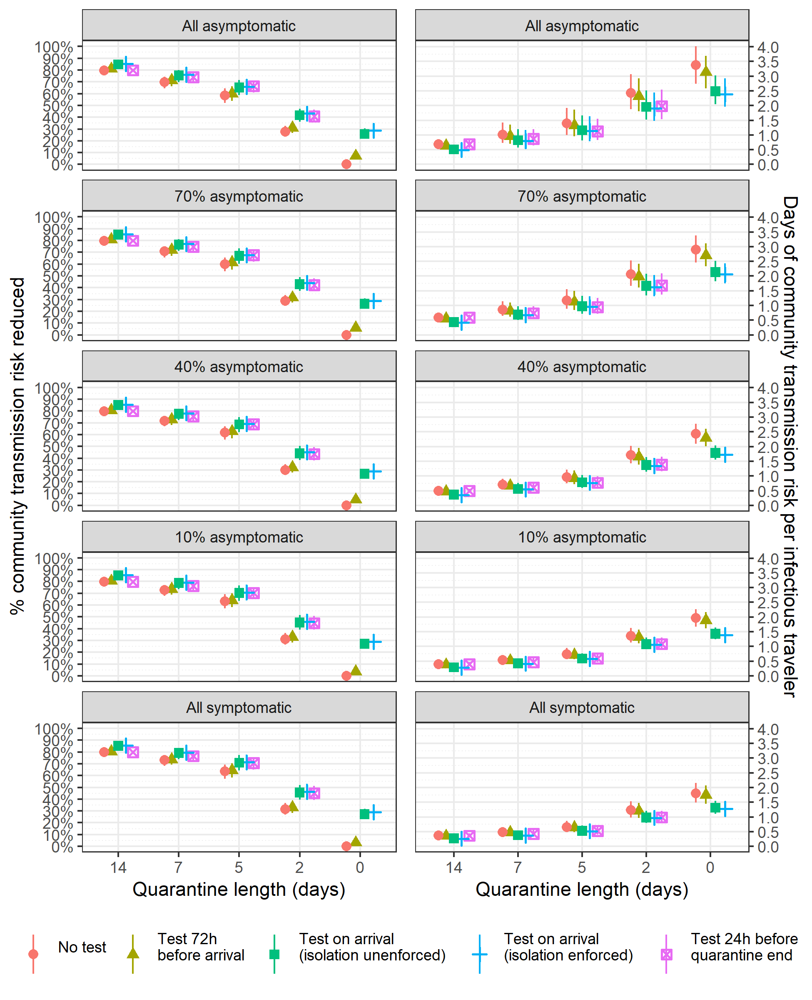

\newcommand{\1}{\textbf{1}}


<br>

W. Alton Russell^1^, David L. Buckeridge^2^

<br>

^1^MGH Institute for Technology Assessment, Harvard Medical School, Boston, MS, USA

^2^School of Population and Global Health, McGill University, Montreal, QC, Canada 


<br>


**CORRESPONDING AUTHOR**

W. Alton Russell

Institute for Technology Assessment

Massachusetts General Hospital

101 Merrimac St

Boston, MA 02114, United States

+1 438-408-7290 (cell)

warussell@mgh.harvard.edu

<br>

Brief report, 697/700 words

#####


```{r setup, include=FALSE}
library(ggplot2)
library(data.table)
library(coarseDataTools)
library(googlesheets4)
library(gridExtra)
library(flextable)
library(officedown)
library(officer)
library(scales)
#library(knitr)
theme_set(theme_bw())

source("../quarantineApp/quarantine-functions.R")


dt_scenarios <- fread("../scenarios.csv")
dt_scenarios <- unique(dt_scenarios)

#Format numbers
fnum <- function(num){
  return(
    ifelse( num < 0.1, sprintf("%.3f", round(num,3)),
            ifelse(num < 1,
                   sprintf("%.2f", round(num,2)),
                   sprintf("%.1f", round(num,1))
                   )
            )
  )
  
}

factorize_dt <- function(dt){
  dt[ , quarantine_length := factor(quarantine_length, levels = as.character(14:0))]
  dt[ , testing := factor(testing, levels = c("None", "3 days prior", "On arrival unenforced", "On arrival enforced", "At end"))]
}


params <- list(
            prob_asympt = 0.4,
            prob_isolate_test = 0.9,
            prob_isolate_sympt = 0.8,
            prob_isolate_both = 1.0,
            sn_presympt = 0.7,
            sn_sympt = 0.7,
            sn_asympt = 0.6,
            prob_quarantine_compliance = 0.8,
            dur_presympt_mean_lb = 1.8,
            dur_presympt_mean_ub = 2.8,
            dur_presympt_var_lb = 4.0,
            dur_presympt_var_ub = 6.0,
            dur_presympt_shift = 0.5,
            dur_sympt_mean_lb = 2.6,
            dur_sympt_mean_ub = 3.9,
            dur_sympt_var_lb = 3.0,
            dur_sympt_var_ub = 4.5,
            dur_asympt_mean_lb = 4.0,
            dur_asympt_mean_ub = 6.0,
            dur_asympt_var_lb = 4.0,
            dur_asympt_var_ub = 6.0,
            dur_latent_min = 0.5,
            n_iters = 1000,
            dur_quarantine_alone = c(0, 2, 5, 7, 14),
            dur_quarantine_endtest = c(2, 5, 7, 14),
            dur_quarantine_arrivetest = c(0, 2, 5, 7, 14),
            dur_quarantine_pretest = c(0, 2, 5, 7, 14),
            seed = 91,
            infection_timing = "rand_nosympt_24hr_before_arrival",
            rr_asympt = 0.49 #Relative risk for transmission from asympt vs. sympt person
        )


#Incubation time from Lauer 2020 bootstrapped posteriors
incubation_dist_fit_lnorm <- readRDS("../incubation_dists/ncov_inc_fit_boot.rds")
dt_incubation_dists_lnorm <- data.table(incubation_dist_fit_lnorm@samples)
```


```{r run_sims, include=FALSE, eval=FALSE}


#Base scenario
dt_metrics_basecase <- cbind(
  run_sim(params = params, dt_incubation_dists_lnorm = dt_incubation_dists_lnorm),
  scenario = "Base scenario"
)

dt_scenarios <- rbind(dt_metrics_basecase)


#Perfect compliance
params.perfect_compliance <- params
params.perfect_compliance$prob_isolate_test = 1
params.perfect_compliance$prob_isolate_sympt = 1
params.perfect_compliance$prob_isolate_both = 1
params.perfect_compliance$prob_quarantine_compliance = 1

Sys.time()
dt_metrics_perf_compliance <- cbind(
  run_sim(params = params.perfect_compliance, dt_incubation_dists_lnorm = dt_incubation_dists_lnorm),
  scenario = "Perfect compliance"
)


dt_scenarios <- rbind(dt_scenarios, 
                      dt_metrics_perf_compliance)


#Low compliance
params.low_compliance <- params
params.low_compliance$prob_isolate_test = 0.5
params.low_compliance$prob_isolate_sympt = 0.5
params.low_compliance$prob_isolate_both = 0.7
params.low_compliance$prob_quarantine_compliance = 0.5


Sys.time()
dt_metrics_low_compliance <- cbind(
  run_sim(params = params.low_compliance, dt_incubation_dists_lnorm = dt_incubation_dists_lnorm),
  scenario = "Low compliance"
)


dt_scenarios <- rbind(dt_scenarios, 
                      dt_metrics_low_compliance)

#Low asymptomatic
params_asympt_low <- params
params_asympt_low$prob_asympt = .1

Sys.time()
dt_metrics_asympt_low <- cbind(
  run_sim(params = params_asympt_low, dt_incubation_dists_lnorm = dt_incubation_dists_lnorm),
  scenario = "10% asymptomatic"
)

dt_scenarios <- rbind(dt_scenarios, 
                      dt_metrics_asympt_low)

#High asymptomatic
params_asympt_high <- params
params_asympt_high$prob_asympt = .7

Sys.time()
dt_metrics_asympt_high <- cbind(
  run_sim(params = params_asympt_high, dt_incubation_dists_lnorm = dt_incubation_dists_lnorm),
  scenario = "70% asymptomatic"
)


dt_scenarios <- rbind(dt_scenarios, 
                      dt_metrics_asympt_high)

#all asymptomatic
params_all_asympt <- params
params_all_asympt$prob_asympt = 1

Sys.time()
dt_metrics_all_asympt <- cbind(
  run_sim(params = params_all_asympt, dt_incubation_dists_lnorm = dt_incubation_dists_lnorm),
  scenario = "All asymptomatic"
)

dt_scenarios <- rbind(dt_scenarios, 
                      dt_metrics_all_asympt)

#all symptomatic
params_all_sympt <- params
params_all_sympt$prob_asympt = 0

Sys.time()
dt_metrics_all_sympt <- cbind(
  run_sim(params = params_all_sympt, dt_incubation_dists_lnorm = dt_incubation_dists_lnorm),
  scenario = "All symptomatic"
)

dt_scenarios <- rbind(dt_scenarios, 
                      dt_metrics_all_sympt)

#Perfect sensitivity
params_sn_perfect <- params
params_sn_perfect$sn_asympt = 1
params_sn_perfect$sn_presympt = 1
params_sn_perfect$sn_sympt = 1

Sys.time()
dt_metrics_sn_perfect <- cbind(
  run_sim(params = params_sn_perfect, dt_incubation_dists_lnorm = dt_incubation_dists_lnorm),
  scenario = "100% Sn when infectious"
)


dt_scenarios <- rbind(dt_scenarios, 
                      dt_metrics_sn_perfect)


## Infection timing assumptions

#Infectioned at quarantine start
params_inf_on_arrival <- params
params_inf_on_arrival$infection_timing <- "on_arrival"

Sys.time()
dt_metrics_infect_on_arrival <- cbind(
  run_sim(params = params_inf_on_arrival, dt_incubation_dists_lnorm = dt_incubation_dists_lnorm),
  scenario = "Infected on arrival"
)


dt_scenarios <- rbind(dt_scenarios, 
                      dt_metrics_infect_on_arrival)

#Traveling while symptomatic
params_travel_while_symptomatic <- params
params_travel_while_symptomatic$infection_timing <- "rand_incl_sympt"

Sys.time()
dt_metrics_travel_while_symptomatic <- cbind(
  run_sim(params = params_travel_while_symptomatic, dt_incubation_dists_lnorm = dt_incubation_dists_lnorm),
  scenario = "Traveling with symptoms"
)

dt_scenarios <- rbind(dt_scenarios, 
                      dt_metrics_travel_while_symptomatic)

fwrite(dt_scenarios, file = "../scenarios.csv")

#Traveling while symptomatic
params_nosympt_before_arrival <- params
params_nosympt_before_arrival$infection_timing <- "rand_nosympt_before_arrival"

Sys.time()
dt_metrics_nosympt_before_arrival <- cbind(
  run_sim(params = params_nosympt_before_arrival, dt_incubation_dists_lnorm = dt_incubation_dists_lnorm),
  scenario = "No symptoms before arrival"
)

dt_scenarios <- rbind(dt_scenarios, 
                      dt_metrics_nosympt_before_arrival)

fwrite(dt_scenarios, file = "../scenarios.csv")


# dt_test_scenarios <- dt_scenarios[scenario %in% c("Perfect compliance", "Low compliance")]
# 
# #Test on arrival; Perfect compliance
# params.toa_perfect_compliance <- params.perfect_compliance
# params.toa_perfect_compliance$test_on_arrival = TRUE
# 
# Sys.time()
# dt_metrics_toa_perfect_compliance <- cbind(
#   run_sim(params = params.toa_perfect_compliance, dt_incubation_dists_lnorm = dt_incubation_dists_lnorm),
#   scenario = "TOA perfect compliance"
# )
# #dt_metrics_test_twice <- dt_metrics_test_twice[!(quarantine_length == 0 & testing == 1)]
# dt_test_scenarios <- add_scenario(dt_test_scenarios, dt_metrics_toa_perfect_compliance)
# 
# #Test on arrival; low compliance
# params.toa_low_compliance <- params.low_compliance
# params.toa_low_compliance$test_on_arrival = TRUE
# 
# Sys.time()
# dt_metrics_toa_low_compliance <- cbind(
#   run_sim(params = params.toa_low_compliance, dt_incubation_dists_lnorm = dt_incubation_dists_lnorm),
#   scenario = "TOA low compliance"
# )
# #dt_metrics_test_twice <- dt_metrics_test_twice[!(quarantine_length == 0 & testing == 1)]
# dt_test_scenarios <- add_scenario(dt_test_scenarios, dt_metrics_toa_low_compliance)
# 
# fwrite(dt_test_scenarios, file = "../test_scenarios.csv")

```


```{r gen_figs, include = FALSE, eval=FALSE}


# scenario_labs <- c("Base scenario",
#                           "All symptomatic",
#                           "10% asymptomatic",
#                           "70% asymptomatic",
#                           "All asymptomatic",
#                           "Low compliance",
#                           "Perfect compliance",
#                           "100% Sn when infectious",
#                           "Infected on arrival",
#                           "Traveling with symptoms" )
# 
# names(scenario_labs) <- c("Base scenario",
#                           "All symptomatic",
#                           "10% asymptomatic",
#                           "70% asymptomatic",
#                           "All asymptomatic",
#                           "Low compliance",
#                           "Perfect compliance",
#                           "100% Sn when infectious",
#                           "Infected on arrival",
#                           "Traveling with symptoms" )
                                    
  


# plt_scenarios <-    ggplot(data = dt_scenarios)+
#       geom_pointrange(aes(x = testing, y = q0.5, ymin = q0.01, ymax = q0.99, color = factor(quarantine_length), group = factor(quarantine_length)),
#                       position = position_dodge(width = 0.2))+
#       facet_wrap(facets=vars(scenario), ncol = 5, labeller = labeller(scenario = scenario_labs))+
#       xlab("")+
#       ylab("Days at risk of community transmission per infected traveler")+
#       scale_color_discrete(name="Quarantine length (days)", ))+
#       scale_x_discrete(labels = c("No test", "Test"))+
#       geom_line(aes(x = testing, y = q0.5, group = factor(quarantine_length), color = factor(quarantine_length)), linetype="dashed", position = position_dodge(width = 0.2))+
#       theme(legend.position = "bottom",
#             strip.text.x = element_text(size = 8),
#             axis.text = element_text(size = 8),
#             axis.title = element_text(size = 8),
#             legend.text = element_text(size = 8),
#             legend.title = element_text(size = 8))
# 
# ggsave(
#   "figs/fig_scenarios.png",
#   width = 6.5,
#   height = 5,
#   units = "in"
# )

#Extract a legend
g_legend<-function(a.gplot){
  tmp <- ggplot_gtable(ggplot_build(a.gplot))
  leg <- which(sapply(tmp$grobs, function(x) x$name) == "guide-box")
  legend <- tmp$grobs[[leg]]
  return(legend)}


# COMPLIANCE
scenarios_plt <- c("Perfect compliance", "Base scenario", "Low compliance")
test_scenario_labs <- c("No test\n", "Test 72h\nbefore arrival\n", "Test on arrival\n(isolation unenforced)\n",
                     "Test on arrival\n(isolation enforced)\n","Test 24h before\nquarantine end\n")

dt_perc_risk_reduced <- factorize_dt(dcast(dt_scenarios[scenario %in% scenarios_plt],  quarantine_length+testing+scenario ~ quantile, value.var = "perc_risk_reduced"))


# dt_2outome <- rbind(cbind(outcome="% community transmission\nrisk reduced", dt_perc_risk_reduced), 
#                     cbind(outcome="Days of community transmission risk\nper infected traveler (adjusted)",dt_d_tot_adj))


dt_perc_risk_reduced[, scenario := factor(scenario, levels=scenarios_plt)]

p_risk <- ggplot(dt_perc_risk_reduced)+
  geom_pointrange(aes(x = quarantine_length, y = q0.5,  ymin = q0.01, ymax = q0.99, color= testing, shape=testing), position = position_dodge(width = 0.6))+
  facet_wrap(vars(scenario), ncol = 1)+
  scale_y_continuous(labels = label_percent(accuracy=1), breaks = seq(0,1,0.1),minor_breaks = seq(0.05, 0.95, 0.1), limits = c(0,1))+
  ylab("% community transmission risk reduced")+
  xlab("Quarantine length (days)")+
  scale_color_discrete(name = "Testing scenario", labels = test_scenario_labs)+scale_shape(name = "Testing scenario", labels = test_scenario_labs)+
  theme(legend.position = "right",
        panel.grid.minor = element_line(linetype="dotted"))

ggsave("./figs/perc_risk_reduced_compliance.png",
       width=6.5, height = 7, units="in")


dt_d_tot <- factorize_dt(dcast(dt_scenarios[scenario %in% scenarios_plt],  quarantine_length+testing+scenario ~ quantile, value.var = "d_tot"))
dt_d_tot[, scenario := factor(scenario, levels=scenarios_plt)]

p_days <- ggplot(dt_d_tot)+
  geom_pointrange(aes(x = quarantine_length, y = q0.5,  ymin = q0.01, ymax = q0.99, color= testing, shape=testing), position = position_dodge(width = 0.6))+
  facet_wrap(vars(scenario), ncol = 1)+
  scale_y_continuous(breaks = seq(0, 10, 0.5),minor_breaks = seq(0.25, 9.75, 0.5), limits = c(0,NA),position = "right",
                     name="Days of community transmission risk per infectious traveler")+
  xlab("Quarantine length (days)")+
  scale_color_discrete(name = "", labels = test_scenario_labs)+scale_shape(name = "", labels = test_scenario_labs)+
  theme(legend.position = "right",
        panel.grid.minor = element_line(linetype="dotted"))

p_2outcomes <- grid.arrange(arrangeGrob(p_risk + theme(legend.position="none"),
                         p_days + theme(legend.position="none"),
                         nrow=1),
             g_legend(p_days+theme(legend.position = "bottom")+labs(shape="", color="")), nrow=2,heights=c(10, 1))

ggsave("./figs/compliance_2outcomes.png", p_2outcomes,
       width=6.5, height = 7, units="in")


# Infection timing
scenarios_plt <- c("No symptoms before arrival", "<24h of symptoms on arrival",  "Traveling with symptoms", "Infected on arrival")

dt_scenarios_temp<-rbind(dt_scenarios)
dt_scenarios_temp[scenario=="Base scenario", scenario := "<24h of symptoms on arrival"]

dt_perc_risk_reduced <- factorize_dt(dcast(dt_scenarios_temp[scenario %in% scenarios_plt],  quarantine_length+testing+scenario ~ quantile, value.var = "perc_risk_reduced"))

dt_perc_risk_reduced[, scenario := factor(scenario, levels=scenarios_plt)]

p_risk <- ggplot(dt_perc_risk_reduced)+
  geom_pointrange(aes(x = quarantine_length, y = q0.5,  ymin = q0.01, ymax = q0.99, color= testing, shape=testing), position = position_dodge(width = 0.6))+
  facet_wrap(vars(scenario), ncol = 1)+
  scale_y_continuous(labels = label_percent(accuracy=1), breaks = seq(0,1,0.1),minor_breaks = seq(0.05, 0.95, 0.1), limits = c(0,1))+
  ylab("% community transmission risk reduced")+
  xlab("Quarantine length (days)")+
  scale_color_discrete(name = "Testing scenario", labels = test_scenario_labs)+scale_shape(name = "Testing scenario", labels = test_scenario_labs)+
  theme(legend.position = "right",
        panel.grid.minor = element_line(linetype="dotted"))

ggsave("./figs/perc_risk_reduced_infection_timing.png",
       width=6.5, height = 8, units="in")

dt_d_tot <- factorize_dt(dcast(dt_scenarios_temp[scenario %in% scenarios_plt],  quarantine_length+testing+scenario ~ quantile, value.var = "d_tot"))
dt_d_tot[, scenario := factor(scenario, levels=scenarios_plt)]

p_days <- ggplot(dt_d_tot)+
  geom_pointrange(aes(x = quarantine_length, y = q0.5,  ymin = q0.01, ymax = q0.99, color= testing, shape=testing), position = position_dodge(width = 0.6))+
  facet_wrap(vars(scenario), ncol = 1)+
  scale_y_continuous(breaks = seq(0, 10, 0.5),minor_breaks = seq(0.25, 9.75, 0.5), limits = c(0,NA),position = "right",
                     name="Days of community transmission risk per infectious traveler")+
  xlab("Quarantine length (days)")+
  scale_color_discrete(name = "", labels = test_scenario_labs)+scale_shape(name = "", labels = test_scenario_labs)+
  theme(legend.position = "right",
        panel.grid.minor = element_line(linetype="dotted"))

p_2outcomes <- grid.arrange(arrangeGrob(p_risk + theme(legend.position="none"),
                         p_days + theme(legend.position="none"),
                         nrow=1),
             g_legend(p_days+theme(legend.position = "bottom")+labs(shape="", color="")), nrow=2,heights=c(10, 1))

ggsave("./figs/infection_timing_2outcomes.png", p_2outcomes,
       width=6.5, height = 8, units="in")

# % symptomatic
scenarios_plt <- c("All asymptomatic", "70% asymptomatic",  "40% asymptomatic", "10% asymptomatic", "All symptomatic")

dt_scenarios_temp<-rbind(dt_scenarios)
dt_scenarios_temp[scenario=="Base scenario", scenario := "40% asymptomatic"]

dt_perc_risk_reduced <- factorize_dt(dcast(dt_scenarios_temp[scenario %in% scenarios_plt],  quarantine_length+testing+scenario ~ quantile, value.var = "perc_risk_reduced"))

dt_perc_risk_reduced[, scenario := factor(scenario, levels=scenarios_plt)]

p_risk <- ggplot(dt_perc_risk_reduced)+
  geom_pointrange(aes(x = quarantine_length, y = q0.5,  ymin = q0.01, ymax = q0.99, color= testing, shape=testing), position = position_dodge(width = 0.6))+
  facet_wrap(vars(scenario), ncol = 1)+
  scale_y_continuous(labels = label_percent(accuracy=1), breaks = seq(0,1,0.1),minor_breaks = seq(0.05, 0.95, 0.1), limits = c(0,1))+
  ylab("% community transmission risk reduced")+
  xlab("Quarantine length (days)")+
  scale_color_discrete(name = "Testing scenario", labels = test_scenario_labs)+scale_shape(name = "Testing scenario", labels = test_scenario_labs)+
  theme(legend.position = "right",
        panel.grid.minor = element_line(linetype="dotted"))

ggsave("./figs/perc_risk_reduced_perc_asympt.png",
       width=6.5, height = 8, units="in")

dt_d_tot <- factorize_dt(dcast(dt_scenarios_temp[scenario %in% scenarios_plt],  quarantine_length+testing+scenario ~ quantile, value.var = "d_tot"))
dt_d_tot[, scenario := factor(scenario, levels=scenarios_plt)]

p_days <- ggplot(dt_d_tot)+
  geom_pointrange(aes(x = quarantine_length, y = q0.5,  ymin = q0.01, ymax = q0.99, color= testing, shape=testing), position = position_dodge(width = 0.6))+
  facet_wrap(vars(scenario), ncol = 1)+
  scale_y_continuous(breaks = seq(0, 10, 0.5),minor_breaks = seq(0.25, 9.75, 0.5), limits = c(0,NA),position = "right",
                     name="Days of community transmission risk per infectious traveler")+
  xlab("Quarantine length (days)")+
  scale_color_discrete(name = "", labels = test_scenario_labs)+scale_shape(name = "", labels = test_scenario_labs)+
  theme(legend.position = "right",
        panel.grid.minor = element_line(linetype="dotted"))

p_2outcomes <- grid.arrange(arrangeGrob(p_risk + theme(legend.position="none"),
                         p_days + theme(legend.position="none"),
                         nrow=1),
             g_legend(p_days+theme(legend.position = "bottom")+labs(shape="", color="")), nrow=2,heights=c(10, 1))

ggsave("./figs/perc_asymptomatic_2outcomes.png", p_2outcomes,
       width=6.5, height = 8, units="in")

# Sensitivity
scenarios_plt <- c("Base scenario",  "100% Sn when infectious")


dt_perc_risk_reduced <- factorize_dt(dcast(dt_scenarios[scenario %in% scenarios_plt],  quarantine_length+testing+scenario ~ quantile, value.var = "perc_risk_reduced"))

dt_perc_risk_reduced[, scenario := factor(scenario, levels=scenarios_plt)]

p_risk <- ggplot(dt_perc_risk_reduced)+
  geom_pointrange(aes(x = quarantine_length, y = q0.5,  ymin = q0.01, ymax = q0.99, color= testing, shape=testing), position = position_dodge(width = 0.6))+
  facet_wrap(vars(scenario), ncol = 1)+
  scale_y_continuous(labels = label_percent(accuracy=1), breaks = seq(0,1,0.1),minor_breaks = seq(0.05, 0.95, 0.1), limits = c(0,1))+
  ylab("% community transmission risk reduced")+
  xlab("Quarantine length (days)")+
  scale_color_discrete(name = "Testing scenario", labels = test_scenario_labs)+scale_shape(name = "Testing scenario", labels = test_scenario_labs)+
  theme(legend.position = "right",
        panel.grid.minor = element_line(linetype="dotted"))

ggsave("./figs/perc_risk_reduced_test_sensitivity.png",
       width=6.5, height = 6, units="in")


dt_d_tot <- factorize_dt(dcast(dt_scenarios[scenario %in% scenarios_plt],  quarantine_length+testing+scenario ~ quantile, value.var = "d_tot"))
dt_d_tot[, scenario := factor(scenario, levels=scenarios_plt)]

p_days <- ggplot(dt_d_tot)+
  geom_pointrange(aes(x = quarantine_length, y = q0.5,  ymin = q0.01, ymax = q0.99, color= testing, shape=testing), position = position_dodge(width = 0.6))+
  facet_wrap(vars(scenario), ncol = 1)+
  scale_y_continuous(breaks = seq(0, 10, 0.5),minor_breaks = seq(0.25, 9.75, 0.5), limits = c(0,NA),position = "right",
                     name="Days of community transmission risk per infectious traveler")+
  xlab("Quarantine length (days)")+
  scale_color_discrete(name = "", labels = test_scenario_labs)+scale_shape(name = "", labels = test_scenario_labs)+
  theme(legend.position = "right",
        panel.grid.minor = element_line(linetype="dotted"))

p_2outcomes <- grid.arrange(arrangeGrob(p_risk + theme(legend.position="none"),
                         p_days + theme(legend.position="none"),
                         nrow=1),
             g_legend(p_days+theme(legend.position = "bottom")+labs(shape="", color="")), nrow=2,heights=c(10, 1))

ggsave("./figs/test_sensitivity_2outcomes.png", p_2outcomes,
       width=6.5, height = 6, units="in")


```


```{r table_scenarios, include = FALSE}


dt_perc_risk_reduced <- factorize_dt(dcast(dt_scenarios,  quarantine_length+testing+scenario ~ quantile, value.var = "perc_risk_reduced"))
dt_d_tot <- factorize_dt(dcast(dt_scenarios,  quarantine_length+testing+scenario ~ quantile, value.var = "d_tot"))
dt_d_tot_adj <- factorize_dt(dcast(dt_scenarios,  quarantine_length+testing+scenario ~ quantile, value.var = "d_tot_adj"))

dt_table <- rbind(cbind(outcome="Percent risk reduced", dt_perc_risk_reduced),
                  cbind(outcome="Days with community transmission risk", dt_d_tot),
                  cbind(outcome="Adjusted days with community transmission risk", dt_d_tot_adj))


dt_table[ , scenario := factor(scenario, levels = c("Base scenario", "Perfect compliance", "Low compliance", "All asymptomatic", 
                                                    "70% asymptomatic",  "40% asymptomatic", "10% asymptomatic", "All symptomatic", 
                                                    "100% Sn when infectious", "No symptoms before arrival", "Traveling with symptoms", 
                                                    "Infected on arrival")) ]
#dt_table[ , testing := ifelse(testing == "On arrival unenforced", "On arrival (default)", testing)]


dt_table[ , print_txt := paste0(
   fnum(q0.5),
  " (", 
  fnum(q0.01),
  " - ", 
  fnum(q0.99),
  ")"
)]

dt_table[outcome=="Percent risk reduced", 
         print_txt := paste0(
   percent(q0.5, accuracy = 0.1),
  " (", 
  sprintf("%.1f", round(100*q0.01,1)),
  " - ", 
  percent(q0.99, accuracy = 0.1),
  ")"
)]


#dt_table<-factorize_dt(dt_table)
dt_table[ , quarantine_length := factor(paste0(quarantine_length, " days"),
                            levels = c("0 days",
                                       "2 days",
                                       "5 days",
                                       "7 days",
                                       "14 days")
                            )]
dt_table[ , Scenario := scenario]
levels(dt_table$testing)[levels(dt_table$testing)=="On arrival unenforced" ] <- "On arrival UE"
dt_table[ , `Test policy` := testing]

dt_table_wide <- dcast(dt_table, outcome+Scenario+`Test policy`~quarantine_length, value.var = "print_txt")


t.riskreduced <- as_flextable(as_grouped_data(dt_table_wide[outcome=="Percent risk reduced", -1], groups="Scenario"))
t.riskreduced <- compose(t.riskreduced, i = ~ !is.na(Scenario),
              value = as_paragraph(Scenario))

t.riskreduced <- width(t.riskreduced, j=1, 1)
t.riskreduced <- width(t.riskreduced, j=2:5, 1.1)
t.riskreduced <- width(t.riskreduced, j=6, 1.2)
t.riskreduced <- theme_box(t.riskreduced)
t.riskreduced <- fontsize(t.riskreduced, size = 8, part = "all")
t.riskreduced <- font(t.riskreduced, fontname = "Times", part = "all")
t.riskreduced <- align(t.riskreduced, i=(1:11)*6-5, align="center")
t.riskreduced<-bg(t.riskreduced, i=(1:11)*6-5, bg = "#DDDDDD")
t.riskreduced<-bg(t.riskreduced, bg = "#EAEAEA", part="header")
t.riskreduced<-padding(t.riskreduced, padding = 2,  part = "all")

t.days_at_risk <- as_flextable(as_grouped_data(dt_table_wide[outcome=="Days with community transmission risk", -1], groups="Scenario"))
t.days_at_risk <- compose(t.days_at_risk, i = ~ !is.na(Scenario),
              value = as_paragraph(Scenario))
#t.days_at_risk <- add_header(t.days_at_risk, "0" <- "Quarantine length (days)")
t.days_at_risk <- width(t.days_at_risk, j=2:6, 1.1)
t.days_at_risk <- width(t.days_at_risk, j=1, 1)
t.days_at_risk <- theme_box(t.days_at_risk)
t.days_at_risk <- fontsize(t.days_at_risk, size = 8, part = "all")
t.days_at_risk <- font(t.days_at_risk, fontname = "Times", part = "all")
t.days_at_risk <- align(t.days_at_risk, i=(1:11)*6-5, align="center")
t.days_at_risk<-bg(t.days_at_risk, i=(1:11)*6-5, bg = "#DDDDDD")
t.days_at_risk<-bg(t.days_at_risk, bg = "#EAEAEA", part="header")
t.days_at_risk<-padding(t.days_at_risk, padding = 2,  part = "all")

t.adj_days_at_risk <- as_flextable(as_grouped_data(dt_table_wide[outcome=="Days with community transmission risk", -1], groups="Scenario"))
t.adj_days_at_risk <- compose(t.adj_days_at_risk, i = ~ !is.na(Scenario),
              value = as_paragraph(Scenario))
t.adj_days_at_risk <- width(t.adj_days_at_risk, j=2:6, 1.1)
t.adj_days_at_risk <- width(t.adj_days_at_risk, j=1, 1)
t.adj_days_at_risk <- theme_box(t.adj_days_at_risk)
t.adj_days_at_risk <- fontsize(t.adj_days_at_risk, size = 8, part = "all")
t.adj_days_at_risk <- font(t.adj_days_at_risk, fontname = "Times", part = "all")
t.adj_days_at_risk <- align(t.adj_days_at_risk, i=(1:11)*6-5, align="center")
t.adj_days_at_risk<-bg(t.adj_days_at_risk, i=(1:11)*6-5, bg = "#DDDDDD")
t.adj_days_at_risk<-bg(t.adj_days_at_risk, bg = "#EAEAEA", part="header")
t.adj_days_at_risk<-padding(t.adj_days_at_risk, padding = 2,  part = "all")
```


# Background


> Many countries have developed policies to reduce the risk of arriving travelers introducing new SARS-CoV-2 transmission chains, particularly for new genetic variants of the virus. Many factors influence the relative effectiveness of policies, and their relative influence has not been described.

# Objectives

> To estimate the effectiveness of mandatory quarantine, SARS-CoV-2 testing, and combined quarantine and testing for arriving travelers at different levels of compliance. To develop a webtool for evaluating policies in user-defined scenarios.

# Methods and findings

> We developed a mathematical model and simulated mandatory quarantine policies of 0--14 days and four testing policies: testing 72h before arrival, testing on arrival (with and without enforced isolation following a positive test), and testing 24h before quarantine end. In the '24h before quarantine end' scenario, travelers who did not comply with quarantine were not tested, and travelers who tested positive in the '72h before arrival' and 'on arrival with enforcement' scenarios never entered the community. The durations of infection phases were sampled from distributions (supplemental methods; Supplemental Figure S1) [@Lauer2020; @Moghadas2020]. 40% of infected travelers had asymptomatic infections and experienced 'pre-infectious' and 'asymptomatic-infectious' phases; 60% had symptomatic infections and experienced 'pre-infectious', 'pre-symptomatic-infectious', and 'symptomatic-infectious' phases. In the base scenario, we assumed 80% of travelers would comply with quarantine, 80% would isolate when symptomatic, 90% would isolate after testing positive, and 100% would isolate after testing positive if symptomatic. We assumed a test sensitivity of 70% for symptomatic infections and 60% for asymptomatic infections during infectious phases, and we assumed pre-infectious infections were undetectable [@Bisoffi2020]. The base scenario assumed symptom onset did not occur more than 24h before arrival; otherwise, the timing of infection relative to arrival was random. For each policy, we estimated the median and 98% credible interval (CrI) of the percent reduction in community transmission risk assuming asymptomatic infections were 49% as transmissible as symptomatic infections [@Shi2020]. The supplement contains results for several scenario analyses (Supplemental Figures S2 – S5 and Tables S1 – S3), and users can modify most parametrs to develop custom scenarios using our webtool (https://shiny.mchi.mcgill.ca/arussel/quarantineTesting/). All data and code are public [@Russell2020a]. 


> We estimated that a 14-day quarantine prevented `r dt_table[Scenario=="Perfect compliance" & quarantine_length=="14 days" & testing=="None" & outcome=="Percent risk reduced", percent(q0.5, accuracy=0.1)]` (CrI `r dt_table[Scenario=="Perfect compliance" & quarantine_length=="14 days" & testing=="None" & outcome=="Percent risk reduced", percent(q0.01, accuracy=0.1)]` -- `r dt_table[Scenario=="Perfect compliance" & quarantine_length=="14 days" & testing=="None" & outcome=="Percent risk reduced", percent(q0.99, accuracy=0.1)]`) of community transmission risk with perfect compliance, but that dropped to `r dt_table[Scenario=="Base scenario" & quarantine_length=="14 days" & testing=="None" & outcome=="Percent risk reduced", print_txt]` in the base scenario and `r dt_table[Scenario=="Low compliance" & quarantine_length=="14 days" & testing=="None" & outcome=="Percent risk reduced", print_txt]` in a low compliance scenario (Figure). In the base scenario, a 7-day quarantine requirement reduced risk by `r dt_table[Scenario=="Base scenario" & quarantine_length=="7 days" & testing=="None" & outcome=="Percent risk reduced", print_txt]` and a 5-day quarantine policy reduced risk by `r dt_table[Scenario=="Base scenario" & quarantine_length=="5 days" & testing=="None" & outcome=="Percent risk reduced", print_txt]`. The addition of testing generally increased quarantine effectiveness. With perfect compliance, adding a test 24h before quarantine end was most effective, but testing on arrival added more value when compliance was low. Regardless of compliance, the added value of testing declined for longer quarantine durations. With no quarantine, testing on arrival with enforced isolation was most effective, reducing `r dt_table[Scenario=="Base scenario" & quarantine_length=="0 days" & testing=="On arrival enforced" & outcome=="Percent risk reduced", print_txt]` of community transmission risk. Testing 72h before arrival reduced risk by only `r dt_table[Scenario=="Base scenario" & quarantine_length=="0 days" & testing=="3 days prior" & outcome=="Percent risk reduced", print_txt]` in the base scenario and by no more than 10% in any of the scenario analyses.

# Discussion

> To reduce risk of COVID-19 transmission from arriving travelers, quarantine is more effective than testing alone. Compliance with quarantine and isolation was the most important factor we examined. For example, 5-day quarantine with perfect compliance (`r dt_table[Scenario=="Perfect compliance" & quarantine_length=="5 days" & testing=="None" & outcome=="Percent risk reduced", percent(q0.5, accuracy=0.1)]`) had a similar median risk reduction to 14-day quarantine in the base case (`r dt_table[Scenario=="Base scenario" & quarantine_length=="14 days" & testing=="None" & outcome=="Percent risk reduced", percent(q0.5, accuracy=0.1)]`). Pre-departure testing did not substantially reduce community transmission risk because most infections were not yet detectable before arriving (Supplemental Figure S6). However, we did not consider in-transit transmission to other travelers, which pre-departure testing may avert. We also did not consider household transmission during quarantine, a significant risk when arriving travelers cohabitate with community members while in quarantine. 

> This analysis estimates the relative effectiveness of policies to reduce the risk of arriving travelers introducing new SARS-CoV-2 transmission chains. The optimal policy will depend on characteristics of arriving travelers (e.g., rate of infection, likelihood of importing a new variant) and conditions in the community (e.g., immunization rate, likelihood that imported cases will necessitate economically damaging lockdowns, health system capacity and utilization, and the economic impact of travel restrictions). The webtool we developed allows exploration of the influence of these characteristics.

#####

# References

<div id="refs"></div>

#####

![**Figure.** Estimated percent community transmission risk reduction of quarantine and testing policies in a perfect compliance scenario, the base scenario, and a low compliance scenario. The base scenario assumes 80% quarantine compliance; 80% isolation compliance following symptom onset; 90% isolation compliance following a positive test result; and 100% isolation compliance with symptoms and a positive test. The low compliance scenario assumes 50% quarantine compliance; 50% isolation compliance following symptom onset or a positive test result; and 70% isolation compliance following symptom onset and a positive test.](figs/perc_risk_reduced_compliance.png)


#####
\setcounter{page}{0}


# Effectiveness of quarantine and testing to prevent COVID-19 transmission from arriving travelers

## Appendix

W. Alton Russell, MS, David L. Buckeridge, MD, PhD, FRCPC

<br>

# Supplemental methods

## Calculation of outcomes

> This report focuses on the percent community risk reduced by each policy, but the model calculates other outcomes as well:

* **Days at risk of community transmission per infected traveler:** the duration (in days) under each policy for which an infected traveler is in the community (i.e., not in quarantine or isolation) and also in an infectious phase (pre-symptomatic infectious, symptomatic infectious, or asymptomatic infectious)
* **Adjusted days at risk of community transmission per infected traveler:** calculated as above except that asymptomatic infection days in the community are multiplied by the relative risk of transmission for asymptomatic as compared to symptomatic infections.
* **Percent community transmission risk reduced:** The percent decrease in the expectation of the adjusted days at risk of community transmission for a policy as compared to a policy of no quarantine and no testing.

> The above outcomes are all independent of the prevalence of infection among travelers and therefore more generalizable. Additional outcomes can be derived for specific scenarios using additional parameters:

* **Days at risk per 10,000 arriving travelers:** Estimated by multiplying the days at risk per infected traveler by the prevalence of active infections among travelers, which report per 10,000 travelers in the webtool.
* **Adjusted Days at risk per 10,000 arriving travelers:** Estimated by multiplying the adjusted days at risk per infected traveler by the prevalence of active infections among travelers, which report per 10,000 travelers in the webtool.
* **Number of secondary cases per 10,000 arriving travelers:** Estimated by multiplying the adjusted days at risk per 10,000 travelers by an estimate for the average number of secondary infections per person-day at risk for a symptomatic infection.

One can derive an estimate of the average number of secondary infections per person-day at risk from an assumed $R_t$, the effective reproductive number for arriving travelers. If travelers' risk behavior differs from that of local residents, travelers' $R_t$ may also differ. For instance, in locations allowing indoor dining and tourist activities, travelers may spend considerably more time in indoor public spaces with high transmission risk and therefore may have a higher $R_t$ than the local population. By contrast, it is possible that travelers will have a lower $R_t$ if travelers exhibit fewer high-risk behaviors as compared to the general populaiton (e.g., by disproportionally avoiding public indoor spaces). Our model assumes an average of 5 infectious days per symptomatic individual (.7 in presymptomatic infectious days and 3.2 symptomatic infectious days for symptomatic individuals; 5 asymptomatic-infectious days for asymptomatic individuals). Thus, one simple estimate for the number of secondary infections per person-day at risk can then be estimated by dividing the estimated $R_t$ by 5. To factor in the relavive risk of transmission for asymptomatic vs. symptomatic infections one could instead factor in the percent asymptomatic infections and the relative transmission risk for asymptomatic vs. symptomatic infectious days.

> These additional outcomes are available in the webtool: https://shiny.mchi.mcgill.ca/arussel/quarantineTesting/

<br>

## Relative transmissibility of asymptomatic infections

Researchers in Wanzhou, China, analyzed epidemiologic data for 183 confirmed COVID-19 cases and their close contacts from five generations of transmission, estimating that asymptomatic infections constitute 32.8% of infected persons and cause 19.3% of infections [@Shi2020]. We calculated the relative risk of transmission for asymptomatic as compared to symptomatic infections as follows:

$$
RR_{\text{asympt vs. sympt}} = \frac{(19.3\%/32.8\%)}{(1-19.3\%)(1-32.8\%)} = 49\%
$$

<br>


## Simulation structure

> We simulated the infection phases of travelers with asymptomatic infections (non-infectious phase and asymptomatic-infectious phase) and symptomatic infections (non-infectious phase, pre-symptomatic-infectious phase, and symptomatic-infectious phase). We used code from Lauer 2020 to sample 1,000 bootstrapped lognormal parameters for the incubation time distribution [@Lauer2020], which had a mean of 5.1 days. Following Moghadas 2020, we used gamma distributions for the durations of asymptomatic-infectious, pre-symptomatic-infectious, and symptomatic-infectious phases. However, we introduced uncertainty by varying the distributions' mean and variance uniformly by ±20%, and we sampled 1,000 parameter sets for the duration distributions. The pre-symptomatic-infectious phase had a mean duration of 2.3 days and a variance of 5 days; the symptomatic-infectious phase had a mean duration of 3.2 days and a variance of 3.7 days; and the asymptomatic-infectious phase had a mean duration of 5 days and a variance of 5 days. For the pre-symptomatic-infectious phase, we shifted the gamma distribution by 0.5 days (so the minimum pre-symptomatic-infectious phase duration was 0.5 days) and recalculated shape and scale parameters to match the mean and variance. Figure S1 shows 100 randomly sampled duration distributions.

> For each of 1,000 sets of duration distributions, we simulated 5,000 travelers with asymptomatic infection and 10,000 travelers with symptomatic infection. For the symptomatic infections, we sampled from the incubation time distribution to get the time of symptom onset and subtracted the pre-symptomatic-infectious phase to get the time of infectiousness, but we imposed a lower limit that the time of infectiousness was at least 0.5 days after infection. We also sampled the duration of the symptomatic-infectious phase to determine the time each traveler would be no longer infectious. For each traveler with an asymptomatic infection, we determined the time of infectiousness similarly and sampled a duration of asymptomatic infectiousness to determine the time the traveler would no longer be infectious. For each traveler, we then calculated the days in the community and infectious in the pre-symptomatic-infectious, symptomatic-infectious, and asymptomatic-infectious phases using the expressions in the next section. We then took the expected value for each of the 1,000 distribution samples and reported the median and the 1st and 99th quantiles.

<br>

## Calculation of days at risk based on quarantine duration and testing

> We calculated the expected number of days at risk of community transmission for each person with an active SARS-CoV-2 infection (either pre-infectious or infectious) at the time of arrival using the expressions below. In these expressions, time is with respect to the time of infection $t_0$, and we assume infections are not detectable before they are infectious.

### Asymptomatic infections

> We assume travelers with asymptomatic infection comply with quarantine with probability $P_q$. If they do not comply, they will be infectious in the community from the greater of the time they become infectious ($t_i$) and the time they arrive ($u$), and their "infectious days in community" will end when they recover, $t_r$. If they comply with quarantine, their infectious days will begin at the greater of $t_i$ and when quarantine ends, represented by $u+d$. 

> **Asymptomatic infections with no testing:** the expected number of days at risk of community transmission for asymptomatic individuals with no testing is:

$\begin{align*}
(1-P_{q})[t_{r} - \max(t_i, u)]^+ + P_{q} [t_r - \max(t_i, u+d)]^+
\end{align*}$

> **Asymptomatic infections with testing 24h before quarantine end:** this scenario assumes those who do not comply with quarantine do not receive testing, and those who comply with quarantine are tested 24h before quarantine ends ($t=u+d-1$). If they are tested before becoming infectious ($u+d-1<t_i$) they will test negative and be at risk of community transmission from the greater of $t_i$ and $d+u$ until $t_r$. If they are tested while infectious, they will only be at risk of community transmission if they test false-negative (probability $1-Sn_A$ where $Sn_A$ is test sensitivity during the asymptomatic-infectious stage) or if they test positive but refuse to quarantine ($Sn_A(1-P_{it})$ where $P_{it}$ is probability of isolation given a positive test and no symptoms). Therefore, the expected number of days at risk of community transmission for asymptomatic individuals with testing 24 hours before end of quarantine is:

$\begin{align*}
(1-P_{q})&[t_{r} - \max(t_i, u)]^+ + \\
P_{q}    &\Big(  \1 _{\{u+d-1<t_i\}} [t_r - \max(t_i, d+u)]^+  + \\
          &\1_{\{u+d - 1 \geq t_i\}} \big((1-Sn_A)+Sn_A (1-P_{it})  \big) [ t_r - (u+d)) ]^+ \Big)
\end{align*}$

> **Asymptomatic infections with testing on arrival without isolation enforcement:** In this scenario, all travelers are tested when they arrive ($t=u$). We assume isolation after testing positive is not strictly enforced; as before, the probability of isolating after a positive test is $P_{it}$. In this testing scenario, the person-days of community risk for a traveler with an asymptomatic infection is:


$\begin{align*}
\1_{ \{ u < t_i \} }    &[ (1-P_{q})[t_{r} - t_i] + P_{q} [t_r - \max(t_i, u+d)]^+ ] + \\
\1_{ \{ u \geq t_i \} } & [(1-P_{q})((1-Sn_A)+Sn_A(1-P_{it}))[t_{r} - u]^+ + \\
                        & \quad P_q ((1-Sn_A)+Sn_A(1-P_{it})) [t_r - (u+d)]^+]
\end{align*}$

> **Asymptomatic infections with testing on arrival with isolation enforcement:** In this scenario, all travelers are tested when they arrive ($t=u$). We assume those who test positive on arrival are either denied entry or have quarantine strictly enforced. The person-days of community risk for a traveler with an asymptomatic infection is:


$\begin{align*}
\1_{ \{ u < t_i \} }    &[ (1-P_{q})[t_{r} - t_i] + P_{q} [t_r - \max(t_i, u+d)]^+ ] + \\
\1_{ \{ u \geq t_i \} } & [(1-P_{q})(1-Sn_A)[t_{r} - u]^+ + \\
                        & \quad P_q (1-Sn_A) [t_r - (u+d)]^+]
\end{align*}$

> **Asymptomatic infections with testing 72h before arrival**: In this scenario, travelers are tested 3 days before arrival ($t=u-3$). We assume those who test positive will be denied entry.


$\begin{align*}
\1_{ \{ u - 3 < t_i \} }    &[ (1-P_{q})[t_{r} - \max(t_i,u)] + P_{q} [t_r - \max(t_i, u+d)]^+ ] + \\
\1_{ \{ u - 3\geq t_i \} } & [(1-P_{q})(1-Sn_A)[t_{r} - \max(t_i,u)]^+ + \\
                        & \quad P_q (1-Sn_A) [t_r - \max(t_i,u+d)]^+]
\end{align*}$


### Symptomatic infections

> For travelers with symptomatic infections, we calculate the days at risk of community transmission separately for the pre-symptomatic and symptomatic infection phases. Days at risk during the pre-symptomatic stage are calculated the same as asymptomatic days except that the endpoint for pre-symptomatic days at risk is the time that symptoms begin ($t_s$) rather than the time of recovery ($t_r$), and we use test sensitivity for detecting an infection in the pre-symptomatic-infectious stage ($Sn_P$). In calculating symptomatic days in the community, we consider that travelers are required to isolate once symptoms develop, and we factor in the probability of compliance with isolation after symptom onset $P_{is}$.


> **Symptomatic infections with no testing:** the expected number of days at risk of community transmission while in **pre-symptomatic phase** with no testing is:

$\begin{align*}
(1-P_{q}) [t_s - \max(t_i, u)]^+ + P_{q} [t_s - \max(t_i,u+d)]^+
\end{align*}$

> We assume travelers will isolate while in symptomatic-infectious stage with probability $P_{is}$. Days at risk while symptomatic begin at $t_s$, the time symptoms begin, and end at $t_r$, the time of recovery when individuals are no longer infectious. Therefore, the expected number of days at risk of community transmission while in **symptomatic phase** with no testing is:

$\begin{align*}
(1-P_{is})\Big( (1-P_{q}) &[t_r - \max(t_s, u)]^+ +\\
P_{q} &[t_r - \max(t_s,u+d)]^+ \Big)
\end{align*}$


> **Symptomatic infections with testing 24h before end of quarantine:** With testing 24h before quarantine end, we assume that the days at risk for those who do not comply with quarantine (probability $(1-P_q)$) is unchanged because they also do not get tested. Those who comply will test negative if they are tested before infectious ($u+d-1<t_i$). With probability $1-P_{is}$ they will not isolate after developing symptoms and will incur days at risk until $t_r$. If tested duirng pre-symptomatic infectious stage ($t_i\leq u+d-1<t_s$), they will incur days at risk while symptomatic  if they test false negative (probability $(1-Sn_P$)) and they do not isolate (probability $(1-P_{is}$) or if they test positive and refuse to isolate ($Sn_P(1-P_{ib})$, where $P_{ib}$ is probabiilty of isolating with both a positive test and symptoms). For those tested while symptomatic, they will incur days at risk if the test is false negative ($1-Sn_S$ where $Sn_S$ is test sensitivity for those in symptomatic-infectious state) or if they test positive and refuse to isolate ($Sn_S(1-P_{ib})$). with testing 24h before the end of quarantine, the expected number of days at risk of community transmission while in **pre-symptomatic phase** is:


$\begin{align*}
(1-P_{q}) &[t_s - \max(t_i, u)]^+ + \\
P_{q} &\Big[\1_{\{u+d-1 < t_i \}} [t_s - \max(t_i, u+d)]^+  + \\
      &\1_{\{u+d-1 \geq t_i\}} \big((1-Sn_P)+Sn_P (1-P_{it})\big)[t_s - (u+d)]^+   \Big]
\end{align*}$


> The expected number of days at risk of community transmission while in the **symptomatic-infectious phase** with testing 24 hours before end of quarantine is:

$\begin{align*}
(1-P_{q})&(1-P_{is}) [t_r - \max(t_s, u))]^+ +\\
P_{q}  & \Bigg(\1_{\{u+d-1 < t_i \}} [ (1-P_{is})[t_r - \max(t_s, u+d)]^+  ]+ \\
       &\1_{\{t_i \leq u+d-1 <  t_s\}} [((1-Sn_P)(1-P_{is})  + Sn_P (1-P_{ib})) [t_r - \max(t_s,u+d)]^+] + \\
       &\1_{\{u+d-1 \geq  t_s\}}[((1-Sn_S)(1-P_{is}) + Sn_S (1- P_{ib})) [t_r - (u+d)]^+] \Bigg)
\end{align*}$


> **Symptomatic infections with testing on arrival without isolation enforcement:** the expected number of days at risk of community transmission while in the **pre-symptomatic phase** is:

$\begin{align*}
\1_{ \{ u < t_i \} }    & [ (1-P_{q})[t_{s} - t_i] + P_{q} [t_s - \max(t_i, u+d)]^+ ] + \\
\1_{ \{ u \geq t_i \} } & [(1-P_{q})((1-Sn_P)+Sn_P(1-P_{it}))[t_{s} - u]^+ + \\
                        & \quad P_q ((1-Sn_P)+Sn_P(1-P_{it})) [t_s - (u+d)]^+]
\end{align*}$

> The expected number of days at risk of community transmission while in the **symptomatic phase** is:

$\begin{align*}
\1_{ \{ u < t_i \} }            & [ (1-P_{q})(1-P_{is})[t_{r} - t_s] + P_{q} (1-P_{is}) [t_r - \max(t_s, u+d)]^+ ] + \\
\1_{ \{ t_i \leq u < t_s \} }   & [ (1-P_{q})((1-Sn_P)(1-P_{is}) + Sn_P(1-P_{ib})) [t_r - t_s] + \\
                                & \quad P_{q} ((1-Sn_P)(1-P_{is}) + Sn_P(1-P_{ib}))[t_r - \max(u+d, t_s)]^+ ] + \\
\1_{ \{ u \geq t_s \} }         &[(1-P_q)((1-Sn_S)(1-P_{is}) + Sn_S (1-P_{ib}))[t_r - u]^+ \\
                                & \quad P_q ((1-Sn_S)(1-P_{is}) + Sn_S (1-P_{ib})) [t_r - (u+d)]^+]
\end{align*}$

> **Symptomatic infections with testing on arrival with isolation enforcement:** the expected number of days at risk of community transmission while in the **pre-symptomatic phase** is:

$\begin{align*}
\1_{ \{ u < t_i \} }    & [ (1-P_{q})[t_{s} - t_i] + P_{q} [t_s - \max(t_i, u+d)]^+ ] + \\
\1_{ \{ u \geq t_i \} } & [(1-P_{q})(1-Sn_P)[t_{s} - u]^+ + P_q (1-Sn_P) [t_s - (u+d)]^+]
\end{align*}$

> The expected number of days at risk of community transmission while in the **symptomatic phase** is:

$\begin{align*}
\1_{ \{ u < t_i \} }            & [ (1-P_{q})(1-P_{is})[t_{r} - t_s] + P_{q} (1-P_{is}) [t_r - \max(t_s, u+d)]^+ ] + \\
\1_{ \{ t_i \leq u < t_s \} }   & [ (1-P_{q})((1-Sn_P)(1-P_{is})) [t_r - t_s] + \\
                                & \quad P_{q} ((1-Sn_P)(1-P_{is}))[t_r - \max(u+d, t_s)]^+ ] + \\
\1_{ \{ u \geq t_s \} }         &[(1-P_q)((1-Sn_S)(1-P_{is}))[t_r - u]^+ \\
                                & \quad P_q ((1-Sn_S)(1-P_{is})) [t_r - (u+d)]^+]
\end{align*}$

> **Symptomatic infections with testing 72h before arrival**: the expected number of days at risk of community transmission while in the **pre-symptomatic phase** is:

$\begin{align*}
\1_{ \{ u - 3 < t_i \} }    & [ (1-P_{q})[t_{s} - \max(t_i, u)] + P_{q} [t_s - \max(t_i, u+d)]^+ ] + \\
\1_{ \{ u-3 \geq t_i \} } & [(1-P_{q})(1-Sn_P)[t_{s} - \max(t_i,u)]^+ +\\
                        & \quad P_q (1-Sn_P) [t_s - \max(t_i, u+d)]^+]
\end{align*}$


> The expected number of days at risk of community transmission while in the **symptomatic phase** is:


$\begin{align*}
\1_{ \{ u - 3 < t_i \} }            & [ (1-P_{q})(1-P_{is})[t_{r} - \max(t_s, u)] + P_{q} (1-P_{is}) [t_r - \max(t_s, u+d)]^+ ] + \\
\1_{ \{ t_i \leq u - 3 < t_s \} }   & [ (1-P_{q})((1-Sn_P)(1-P_{is})) [t_r - \max(t_s, u)]^+ \\
                                & \quad P_{q} ((1-Sn_P)(1-P_{is}))[t_r - \max(t_s, u+d)]^+ ] + \\
\1_{ \{ u - 3 \geq t_s \} }         &[(1-P_q)((1-Sn_S)(1-P_{is}))[t_r - \max(t_s, u)]^+ \\
                                & \quad P_q ((1-Sn_S)(1-P_{is})) [t_r - (u+d)]^+]
\end{align*}$


#####

# Supplemental tables

::: {custom-style="Compact"}
| **Table S1** Estimated percent of transmission risk reduced for quarantine and testing policies in 11 modeling scenarios. Median and 98% credible interval provided.  Abbreviation: UE, unenforced.
:::


`r t.riskreduced`

#####

::: {custom-style="Compact"}
| **Table S2** Expected days at risk of community transmission risk per infectious traveler for quarantine and testing policies in 11 modeling scenarios. Median and 98% credible interval provided.  Abbreviation: UE, unenforced.
:::


`r t.days_at_risk`

#####

::: {custom-style="Compact"}
| **Table S3** Expected adjusted days at risk of community transmission risk per infectious traveler for quarantine and testing policies in 11 modeling scenarios. Days at risk for travelers with asymptomatic infections are multiplied by rhe relative transmission risk of asymptomatic as compared to symptomatic infections (49% in base case). Median and 98% credible interval provided.  Abbreviation: UE, unenforced.
:::


`r t.adj_days_at_risk`

#####

# Supplemental figures

![**Figure S1:** Sample of 100 distributions for durations. Incubation time (top-left) generated using code from Lauer 2020 [@Lauer2020] that generates bootstrapped posterior distributions from a parametric accelerated failure time model calibration. Other distributions generated by varying the mean and variance of distributions from Moghadas 2020 [@Moghadas2020] by ±20% and converting to gamma distribution parameters using the relationships $\mu=ab$ and $\sigma^2=ab^2$ where $\mu$ and $\sigma$ are the mean and variance of the gamma distribution and $a$ and $b$ are the shape and scale parameters. For both symptomatic and asymptomatic infections, duration of the pre-infectious-infectious phase is calculated by subtracting the pre-symptomatic phase duration from the incubation time. If the calculated start of the pre-symptomatic-infectious phase is less than 0.5 days from infection then 0.5 days is used instead.](figs/fig_distribution_sampling.png)


#####


#####





#####


#####


#####


