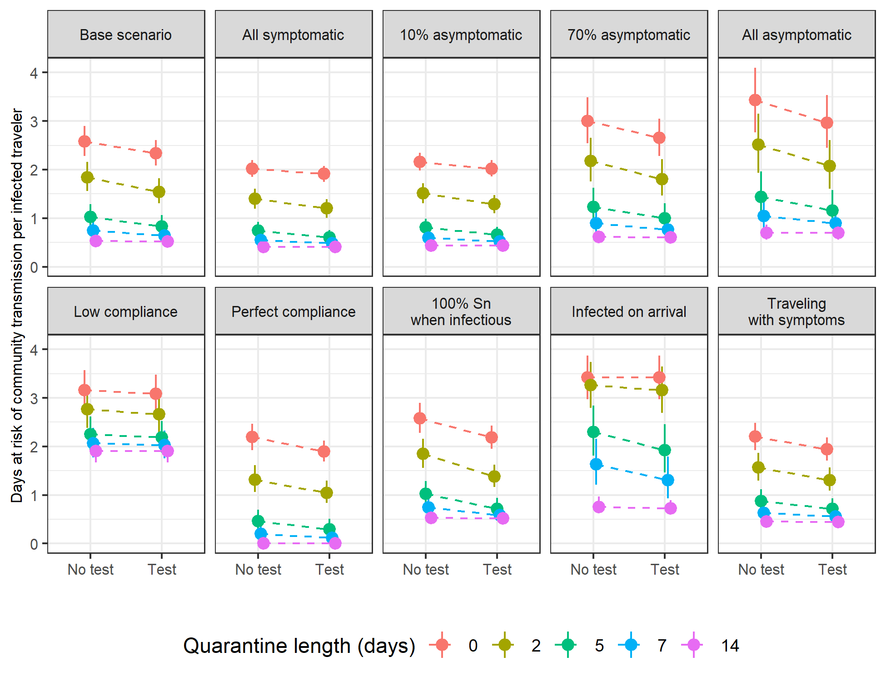
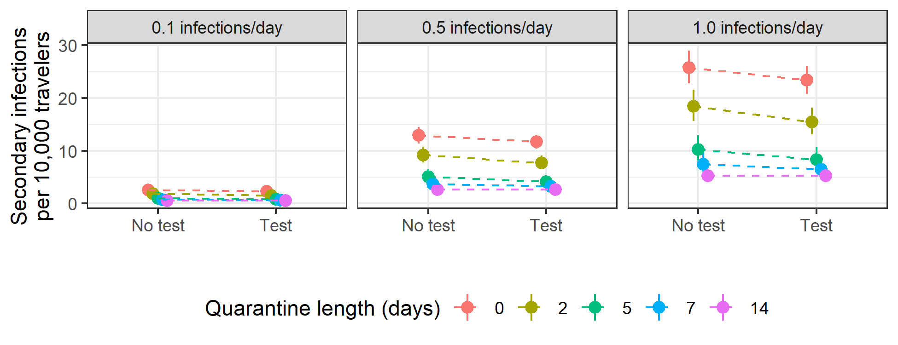
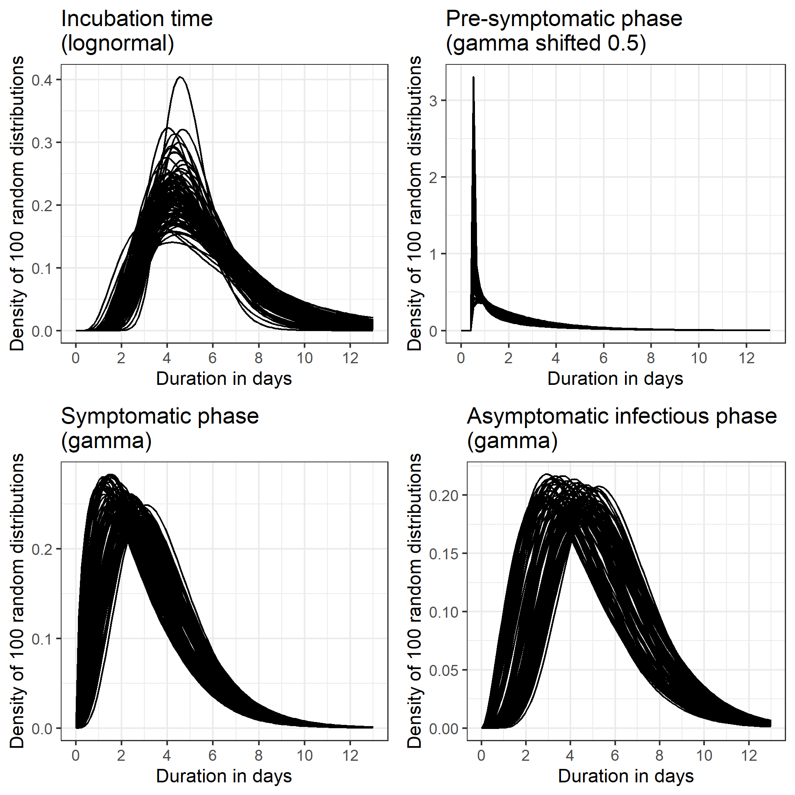
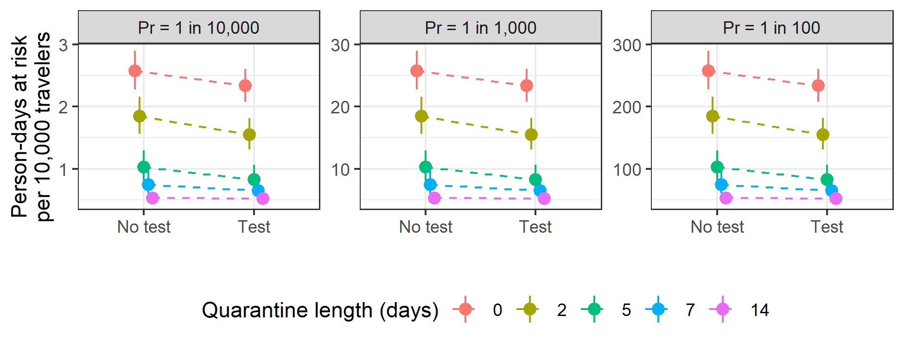

\newcommand{\1}{\textbf{1}}


<br>

W. Alton Russell, MS^1^, David L. Buckeridge, MD, PhD, FRCPC^2^


<br>

^1^Department of Management Science and Engineering, Stanford University, Stanford, CA, USA

^2^School of Population and Global Health, McGill University, Montreal, QC, Canada


<br>

# Corresponding author

W. Alton Russell

Department of Management Science and Engineering

475 Via Ortega

Stanford, CA 94305

438-408-7290

altonr@stanford.edu

#####

```{r setup, include=FALSE}
library(ggplot2)
library(data.table)
library(coarseDataTools)
library(googlesheets4)
library(gridExtra)
library(flextable)
library(officedown)
library(officer)
theme_set(theme_bw())

source("../quarantine.functions.R")

params <- list(
  prob_asympt = 0.24,
  prob_isolate_test = 0.9,
  prob_isolate_sympt = 0.8,
  prob_isolate_both = 1.0,
  sn_presympt = 0.7,
  sn_sympt = 0.7,
  sn_asympt = 0.6,
  prob_quarantine_compliance = 0.8,
  dur_presympt_mean_lb = 1.8,
  dur_presympt_mean_ub = 2.8,
  dur_presympt_var_lb = 4.0,
  dur_presympt_var_ub = 6.0,
  dur_sympt_mean_lb = 2.6,
  dur_sympt_mean_ub = 3.9,
  dur_sympt_var_lb = 3.0,
  dur_sympt_var_ub = 4.5,
  dur_asympt_mean_lb = 4.0,
  dur_asympt_mean_ub = 6.0,
  dur_asympt_var_lb = 4.0,
  dur_asympt_var_ub = 6.0
)


#Policy parameters
pols_dur_quarantine <- c(0, 2, 5, 7, 14)
pols_test <- c(0, 1)
prev_levels <- c(1, 1/100, 1/1000, 1/10000)

dt_scenarios <- fread("../scenarios.csv")
dt_scenarios[ , scenario := factor(scenario,
                                   levels = c(
                                    "Base scenario",
                                    "All asymptomatic",
                                    "All symptomatic",
                                    "17.9% asymptomatic",
                                    "30.8% asymptomatic",
                                    "Low compliance",
                                    "Perfect compliance",
                                    "Infected on arrival",
                                    "Perfect test",
                                    "Asympt. sensitivity 30%"
                                   ))]


```


```{r run_sims, include=FALSE, eval=FALSE}

#Incubation time from Lauer 2020 bootstrapped posteriors
incubation_dist_fit_lnorm <- readRDS("../incubation_dists/ncov_inc_fit_boot.rds")
dt_incubation_dists_lnorm <- data.table(incubation_dist_fit_lnorm@samples)
# 
# temp <- sim_quarantine_lnorm(
#     dt_incubation_dists_lnorm = dt_incubation_dists_lnorm,
#     params = params)
# 
# temp2 <- sim_calc_metrics(
#   dt_raw_metrics = temp,
#   params = params,
#   prev_levels = c(1),
#   scenario = "Blank"
# )
# temp2[, c("scenario", "prev", "metric") := NULL]
# 
# saveRDS(temp2, file = "../sim_dat_raw.RDS")


#Create scenarios
add_scenario <- function(dt_scenarios_wide, dt_scenario_long){
  return(
    rbind(
      dt_scenarios_wide,
      dcast(dt_scenario_long,  prev+metric+dur_q+testing+scenario~quantile, value.var = "value")
    )
  )
}

#Base scenario
Sys.time()
dt_metrics_basecase <- sim_calc_metrics(
  dt_raw_metrics = sim_quarantine_lnorm(
    dt_incubation_dists_lnorm = dt_incubation_dists_lnorm,
    params = params),
  params = params,
  prev_levels = prev_levels,
  scenario = "Base scenario"
)
Sys.time()

dt_scenarios <- dcast(dt_metrics_basecase,  prev+metric+dur_q+testing+scenario ~ quantile, value.var = "value")


#Perfect compliance
params.perfect_compliance <- params
params.perfect_compliance$prob_isolate_test = 1
params.perfect_compliance$prob_isolate_sympt = 1
params.perfect_compliance$prob_isolate_both = 1
params.perfect_compliance$prob_quarantine_compliance = 1

Sys.time()
dt_metrics_perf_compliance <- sim_calc_metrics(
  dt_raw_metrics = sim_quarantine_lnorm(
    dt_incubation_dists_lnorm = dt_incubation_dists_lnorm,
    params = params.perfect_compliance),
  params = params.perfect_compliance,
  prev_levels = prev_levels,
  scenario = "Perfect compliance"
)
Sys.time()

dt_scenarios <- add_scenario(dt_scenarios, dt_metrics_perf_compliance)

#Low compliance
params.low_compliance <- params
params.low_compliance$prob_isolate_test = 0.5
params.low_compliance$prob_isolate_sympt = 0.5
params.low_compliance$prob_isolate_both = 0.7
params.low_compliance$prob_quarantine_compliance = 0.4

Sys.time()
dt_metrics_low_compliance <- sim_calc_metrics(
  dt_raw_metrics = sim_quarantine_lnorm(
    dt_incubation_dists_lnorm = dt_incubation_dists_lnorm,
    params = params.low_compliance),
  params = params.low_compliance,
  prev_levels = prev_levels,
  scenario = "Low compliance"
)
Sys.time()

dt_scenarios <- add_scenario(dt_scenarios, dt_metrics_low_compliance)


#Low asymptomatic
params_asympt_low <- params
params_asympt_low$prob_asympt = .179

Sys.time()
dt_metrics_asympt_low <- sim_calc_metrics(
  dt_raw_metrics = sim_quarantine_lnorm(
    dt_incubation_dists_lnorm = dt_incubation_dists_lnorm,
    params = params_asympt_low),
  params = params_asympt_low,
  prev_levels = prev_levels,
  scenario = "17.9% asymptomatic"
)
Sys.time()

dt_scenarios <- add_scenario(dt_scenarios, dt_metrics_asympt_low)

#High asymptomatic
params_asympt_high <- params
params_asympt_high$prob_asympt = .308

Sys.time()
dt_metrics_asympt_high <- sim_calc_metrics(
  dt_raw_metrics = sim_quarantine_lnorm(
    dt_incubation_dists_lnorm = dt_incubation_dists_lnorm,
    params = params_asympt_high),
  params = params_asympt_high,
  prev_levels = prev_levels,
  scenario = "30.8% asymptomatic"
)
Sys.time()

dt_scenarios <- add_scenario(dt_scenarios, dt_metrics_asympt_high)


#all asymptomatic
params_all_asympt <- params
params_all_asympt$prob_asympt = 1

Sys.time()
dt_metrics_all_asympt <- sim_calc_metrics(
  dt_raw_metrics = sim_quarantine_lnorm(
    dt_incubation_dists_lnorm = dt_incubation_dists_lnorm,
    params = params_all_asympt),
  params = params_all_asympt,
  prev_levels = prev_levels,
  scenario = "All asymptomatic"
)
Sys.time()

dt_scenarios <- add_scenario(dt_scenarios, dt_metrics_all_asympt)

#all symptomatic
params_all_sympt <- params
params_all_sympt$prob_asympt = 0

Sys.time()
dt_metrics_all_sympt <- sim_calc_metrics(
  dt_raw_metrics = sim_quarantine_lnorm(
    dt_incubation_dists_lnorm = dt_incubation_dists_lnorm,
    params = params_all_sympt),
  params = params_all_sympt,
  prev_levels = prev_levels,
  scenario = "All symptomatic"
)
Sys.time()

dt_scenarios <- add_scenario(dt_scenarios, dt_metrics_all_sympt)

#Perfect sensitivity
params_sn_perfect <- params
params_sn_perfect$sn_asympt = 1
params_sn_perfect$sn_presympt = 1
params_sn_perfect$sn_sympt = 1

Sys.time()
dt_metrics_sn_perfect <- sim_calc_metrics(
  dt_raw_metrics = sim_quarantine_lnorm(
    dt_incubation_dists_lnorm = dt_incubation_dists_lnorm,
    params = params_sn_perfect),
  params = params_sn_perfect,
  prev_levels = prev_levels,
  scenario = "Perfect test"
)
Sys.time()

dt_scenarios <- add_scenario(dt_scenarios, dt_metrics_sn_perfect)

# #Poor senstitivity all
# params_sn_poor <- params
# params_sn_poor$sn_asympt = 0.49
# params_sn_poor$sn_presympt = 0.49
# params_sn_poor$sn_sympt = 0.42
# 
# Sys.time()
# dt_metrics_sn_perfect <- sim_calc_metrics(
#   dt_raw_metrics = sim_quarantine_lnorm(
#     dt_incubation_dists_lnorm = dt_incubation_dists_lnorm,
#     params = params_sn_poor),
#   params = params_sn_poor,
#   prev_levels = prev_levels,
#   scenario = "Poor sensitivity"
# )
# Sys.time()
# 
# dt_scenarios <- add_scenario(dt_scenarios, dt_metrics_sn_perfect)


#Poor sensitivity asympt
params_asympt_sn_poor <- params
params_asympt_sn_poor$sn_sympt = 0.3

Sys.time()
dt_metrics_sn_perfect <- sim_calc_metrics(
  dt_raw_metrics = sim_quarantine_lnorm(
    dt_incubation_dists_lnorm = dt_incubation_dists_lnorm,
    params = params_asympt_sn_poor),
  params = params_asympt_sn_poor,
  prev_levels = prev_levels,
  scenario = "Asymptomatic sensitivity 30%"
)
Sys.time()

dt_scenarios <- add_scenario(dt_scenarios, dt_metrics_sn_perfect)

#Infectioned at quarantine start
Sys.time()
dt_metrics_sn_perfect <- sim_calc_metrics(
  dt_raw_metrics = sim_quarantine_lnorm(
    dt_incubation_dists_lnorm = dt_incubation_dists_lnorm,
    params = params_asympt_sn_poor,
    rand_u = FALSE),
  params = params_asympt_sn_poor,
  prev_levels = prev_levels,
  scenario = "Infected on arrival"
)
Sys.time()

dt_scenarios <- add_scenario(dt_scenarios, dt_metrics_sn_perfect)

fwrite(dt_scenarios, file = "../scenarios.csv")

```

# Key words

SARS-CoV-2, COVID-19, travel and immigration policy, quarantine and isolation

<br> 

# Declarations

**Funding:** WAR was supported by a Stanford Interdisciplinary Graduate Fellowship; DLB was supported by a Canada Research Chair in Health Informatics and Data Science.

**Conflicts:** The authors have no conflicts to disclose

**Ethics/Consent:** This analysis was based on public data and was exempt from institutional ethics review.

**Data and materials:** All data and materials have been uploaded to a public repository.

**Code availability:** All code has been uploaded to a public repository.

**Authors’ contributions:** Both authors participated in the study design and analysis. WAR drafted the manuscript, which DLB critically revised.


#####

# Background

> COVID-19 outbreaks caused by infected arriving travelers are a concern for all countries, particularly those with low community transmission. Consequently, the approach to managing the risk of SARS-CoV-2 transmission from arriving travelers is a critical policy question. A recent study estimated the number of symptomatic infections missed by active monitoring of arriving travelers, accounting for the distribution of SARS-CoV-2 incubation times [@Lauer2020]. While informative, the applicability of this analysis to policy decisions is limited because it did not consider factors such as transmission by asymptomatic and pre-symptomatic travelers, the role of non-compliance, and the use of testing.


# Objective

> We evaluated policies of quarantine and testing of arriving travelers and examined the sensitivity of policy choices to assumptions about pre-symptomatic and asymptomatic transmission, test sensitivity, and quarantine and isolation compliance.

# Methods and findings

> We compared policies of mandatory quarantine (0 -- 14 days) alone and combined with testing. For each policy we assessed the expected number of days at risk of community transmission per infected traveler (i.e., days when a person is infectious in the community because they are not in quarantine or isolation). In the base scenario, we assumed 80% of travelers were compliant with quarantine, 80% isolated when symptomatic, 90% isolated after testing positive without symptoms, and 100% isolated after testing positive when symptomatic. For scenarios with testing we assumed antigen testing was performed 24 hours before the end of quarantine and that travelers who did not comply with quarantine were not tested. We assumed a test sensitivity of 70% in pre-symptomatic and symptomatic infectious individuals and 60% in asymptomatic-infectious individuals [@Bisoffi2020].

> We used code from Lauer 2020 to sample 1,000 bootstrapped lognormal parameters for the incubation time distribution [@Lauer2020]. Following Moghadas 2020, we used gamma distributions for the durations of asymptomatic-infectious, pre-symptomatic-infectious, and symptomatic-infectious phases, and we truncated the pre-symptomatic-infectious distribution  from 0.8 to 3 days [@Moghadas2020]. We introduced uncertainty by varying the distributions' mean and variance uniformly by ±20%, and we sampled 1,000 parameter sets for the duration distributions (Figure S1). For each duration parameter set, we simulated 1,000 travelers with asymptomatic infection and 6,000 travelers with symptomatic infection. We determined the time each simulated traveler first became infectious, recovered from being infectious, and first developed symptoms (only for those with symptomatic infections). We assumed that arriving travelers were equally likely to be at any point of their infection. Using expressions described in the supplement, we calculated the average days at risk across all infected travelers assuming 24% of infections were asymptomatic in the base scenario [@Moghadas2020]. We have published all data and code [@Russell2020a].

> In the base scenario, infected travelers were at risk of community transmission 1.7 -- 2.1 days on average with no intervention (Figure 1; Table S2). Assuming a prevalence of 1 active infection per 10,000 travelers and a secondary infection rate of 0.5 per person-day at risk of community transmission, this translated to 8.5 -- 10.4 secondary cases per 10,000 travelers (Figure 2). Even a two-day quarantine was more effective than testing alone (1.1 -- 1.5 days at risk with two-day quarantine vs. 1.5 -- 1.8 with testing alone). Testing had diminishing benefit as the length of quarantine increased (reduction of 0.2, 0.06, and 0.003 days at risk for 2, 7, and 14-day quarantine, respectively). Compliance greatly influenced risk: a 14-day quarantine resulted in 1.3 - 1.6 days at risk assuming low compliance compared to 0 - 0.03 days assuming perfect compliance. If travelers were infected immediately before arriving, their days at risk would be 60% higher than the base scenario assuming no intervention, and testing without quarantine would have little benefit. At the population level, person-days at risk of secondary infection was linear in prevalence (Figure S2). We created a web application that readers can use to interactively assess impact of parameter values on infection risk ([altonrus.shinyapps.io/quarantineapp/](altonrus.shinyapps.io/quarantineapp/)).


# Discussion

> To reduce the risk of SARS-CoV-2 transmission from arriving travelers, quarantine is more effective than testing alone. Testing can add value when longer quarantine is infeasible, but the benefits of testing diminish with quarantine length. Measures to increase compliance with quarantine and isolation can significantly reduce risk. We did not consider household transmission during quarantine, a substantial risk for countries with less strict quarantine enforcement. 


<!---BLOCK_LANDSCAPE_START--->

```{r fig_1, include = FALSE}

dt_scenarios[ , testing := factor(testing)]
dt_scenarios[scenario == "Asymptomatic sensitivity 30%", scenario := "Asympt. sensitivity 30%"]
dt_scenarios_infected <- dt_scenarios[prev == 1]


  


plt_1 <-    ggplot(data = dt_scenarios_infected)+
      geom_pointrange(aes(x = testing, y = q0.5, ymin = q0.01, ymax = q0.99, color = factor(dur_q), group = factor(dur_q)),
                      position = position_dodge(width = 0.2))+
      facet_wrap(facets=vars(scenario), ncol = 5)+
      xlab("")+
      ylab("Days at risk of community transmission per infected traveler")+
      scale_color_discrete(name="Quarantine length (days)")+
      scale_x_discrete(labels = c("No test", "Test"))+
      geom_line(aes(x = testing, y = q0.5, group = factor(dur_q), color = factor(dur_q)), linetype="dashed", position = position_dodge(width = 0.2))+
      theme(legend.position = "bottom")

ggsave(
  "figs/fig1.png",
  width = 8,
  height = 5.5,
  units = "in"
)


```


::: {custom-style="Compact"}
| **Fig. 1** Expected days at risk of community transmission risk per infectious traveler for ten scenarios. Points indicates the median and bars indicate 98% credible interval for each estimate.  "Low compliance" scenario assumes 40% of travelers comply with quarantine, 50% isolate with symptoms or a positive test, and 70% isolate with both symptoms and a positive test.  Abbreviations: asympt, asymptomatic.
:::


<!---BLOCK_LANDSCAPE_STOP--->


```{r fig_2, include = FALSE}

dt_scenarios[ , testing := factor(testing)]

secondary.labs <- c("0.1 infections/day",
                    "0.5 infections/day",
                    "1.0 infections/day")
names(secondary.labs) <- c(0.1, 0.5, 1)

cols = c("q0.01", "q0.5", "q0.99")
dt_secondary <- rbind(
  cbind(dt_scenarios[scenario == "Base scenario" & prev == 1/1000][ , (cols) := lapply(.SD, function(x) x*0.1*10000), .SDcols = cols],
        secondary_factor = 0.1),
  cbind(dt_scenarios[scenario == "Base scenario" & prev == 1/1000][ , (cols) := lapply(.SD, function(x) x*0.5*10000), .SDcols = cols],
        secondary_factor = 0.5),
  cbind(dt_scenarios[scenario == "Base scenario" & prev == 1/1000][ , (cols) := lapply(.SD, function(x) x*1*10000), .SDcols = cols],
        secondary_factor = 1.0)
)

plt_secondarycases <-  ggplot(data = dt_secondary)+
      geom_pointrange(aes(x = testing, y = q0.5, ymin = q0.01, ymax = q0.99, color = factor(dur_q), group = factor(dur_q)),
                      position = position_dodge(width = 0.2))+
      facet_wrap(facets=vars(secondary_factor), labeller = labeller(secondary_factor = secondary.labs))+
      xlab("")+
      ylab("Secondary infections\nper 10,000 travelers")+
      scale_color_discrete(name="Quarantine length (days)")+
      scale_x_discrete(labels = c("No test", "Test"))+
      geom_line(aes(x = testing, y = q0.5, group = factor(dur_q), color = factor(dur_q)), linetype="dashed", position = position_dodge(width = 0.2))+
      theme(legend.position = "bottom")

ggsave(
  "figs/fig2.png",
  width = 6.5,
  height = 2.5,
  units = "in"
)

```

<br>

::: {custom-style="Compact"}
| **Fig. 2** Secondary cases per 10,000 travelers for each policy by expected number of secondary infections per infectious person-day in community (base scenario). Assuming SARS-CoV-2 prevalence of 1 in 1,000 travelers. Points indicates the median and bars indicate 98% credible interval for each estimate.
:::



#####

# References

<div id="refs"></div>


#####
\setcounter{page}{0}
######## Effectiveness of quarantine and testing to limit new COVID-19 cases from arriving travelers

######## Supplement


W. Alton Russell, MS, David L. Buckeridge, MD, PhD, FRCPC

<br>

# Calculation of days at risk based on quarantine duration and testing

> We calculated the expected number of days at risk of community transmission for each person with an active SARS-CoV-2 infection (either pre-infectious or infectious) using the expressions below. In the expressions below, time is with respect to the time of infection $t_0$.

> **Asymptomatic infections** Travelers with asymptomatic infection comply with quarantine with probability $P_q$. If they do not comply, they will be infectious in the community from the greater of the time they become infectious ($t_i$) and the time they arrive ($u$), and their "infectious days in community" will end when they recover, $t_r$. If they comply with quarantine, their infectious days will begin at the greater of $t_i$ and quarantine ends, represented by $u+d$. Therefore, the expected number of days at risk of community transmission for asymptomatic individuals without testing is:

$$
[(1-P_{q})(t_{r} - \max(t_i, u))]^+ + [P_{q} (t_r - \max(t_i, u+d))]^+
$$

> In policies with testing, we assume those who do not comply with quarantine also do not receive testing. Those who are compliant are tested 1 day before quarantine end ($u+d-1$). If they are tested before becoming infectious ($u+d-1<t_i$) they will test negative and be at risk of community transmission from the greater of $t_i$ and $d+u$ until $t_r$. If they are tested while infectious, they will only be at risk of community transmission if they test false-negative (probability $1-Sn_A$ where $Sn_A$ is test sensitivity during the asymptomatic-infectious stage) or if they test positive but refuse to quarantine ($Sn_A(1-P_{it})$ where $P_{it}$ is probability of isolation given a positive test and no symptoms). Therefore, the expected number of days at risk of community transmission for asymptomatic individuals with testing is:

$$
[(1-P_{q})(t_{r} - \max(t_i, u))]^+ + P_{q}\big[  \1 _{\{u+d-1<t_i\}} (t_r - \max(t_i, d+u)) + \1 _{\{u+d - 1 \geq t_i\}} ((1-Sn_A)+Sn_A (1-P_{it})  ) (t_r - (u+d)) \big]^+
$$

> **Symptomatic infections**  For travelers with symptomatic infections we calculate the days at risk of community transmission separately for the pre-symptomatic and symptomatic disease stages. Days at risk during the pre-symptomatic stage are calculated the same as asymptomatic days except that the endpoint for pre-symptomatic days at risk is the time that symptoms begin ($t_s$) rather than the time of recovery ($t_r$), and we use test sensitivity for detecting disease in the pre-symptomatic-infectious stage ($Sn_P$). Therefore, the expected number of days at risk of community transmission while in pre-symptomatic phase without testing is:

$$
[(1-P_{q}) (t_s - \max(t_i, u))]^+ + [P_{q} (t_s - \max(t_i,u+d))]^+
$$

With testing, it becomes: 


$$
[(1-P_{q}) (t_s - \max(t_i, u))]^+ + P_{q} \big[\1_{\{u+d-1 < t_i \}} (t_s - \max(t_i, u+d)) + \1_{\{u+d-1 \geq t_i\}} ((1-Sn_P)+Sn_P (1-P_{it}))(t_s - (u+d))   \big]^+
$$

> We assume travelers will isolate while in symptomatic-infectious stage with probability $P_{is}$. Days at risk while symptomatic begin at $t_s$, the time symptoms begin, and end at $t_r$, the time of recovery when individuals are no longer infectious. Therefore, the expected number of days at risk of community transmission while in symptomatic phase without testing is:

$$
(1-P_{is})\Big( [(1-P_{q}) (t_r - \max(t_s, u))]^+ + [P_{q} (t_r - \max(t_s,u+d))]^+ \Big)
$$

> In policies with testing, we assume that the days at risk for those who do not comply with quarantine (probability $(1-P_q)$) is unchanged because they also do not get tested. For those who comply, if they are tested before infectious ($u+d-1<t_i$) then they will test negative. With probability $1-P_{is}$ they will not isolate and incur days at risk until $t_r$. If tested duirng pre-symptomatic infectious stage ($t_i\leq u+d-1<t_s$), they will incur days at risk while symptomatic only if they test false negative (probability $(1-Sn_P$) and they do not isolate (probability $(1-P_{is}$)). We assume all travelers with both symptoms and a positive test will isolate. For those tested while symptomatic, they will incur days at risk only if the test is false negative ($1-Sn_S$ where $Sn_S$ is test sensitivity for those in symptomatic-infectious state). Therefore, the expected number of days at risk of community transmission while in the symptomatic-infectious phase with testing is:

$$
(1-P_{is}) [(1-P_{q}) (t_r - \max(t_s, u))]^+ + 
P_{q} \Big[
\1_{\{u+d-1 < t_i \}} (t_r - \max(t_s, u+d))(1-P_{is}) + 
\1_{\{t_i \leq u+d-1 <  t_s\}} [(1-Sn_P)(1-P_{is})(t_r - \max(t_s,u+d))  ]+ 
\1_{\{u+d-1 \geq>  t_s\}}  (1-Sn_S)(1-P_{is})(t_r - (u+d))
\Big]^+
$$

<!---BLOCK_LANDSCAPE_START--->


::: {custom-style="Compact"}
| **Table S1** Expected days at risk of community transmission risk per infectious traveler for ten scenarios based on quarantine length and testing. Median and 98% credible interval provided. Abbreviations: asympt, asymptomatic; T, test used; NT, no testing used.
:::

```{r table1, include = FALSE}
dt_table <- dt_scenarios[prev == 1]
dt_table[ , print_txt := paste0(
   formatC(signif(q0.5,digits=2), digits=2,format="fg", flag="#"),
  " (", 
  formatC(signif(q0.01,digits=2), digits=2,format="fg", flag="#"),
  " - ", 
  formatC(signif(q0.99,digits=2), digits=2,format="fg", flag="#"),
  ")"
)]

dt_table[ , dur_q := factor(paste0(dur_q, " days"),
                            levels = c("0 days",
                                       "2 days",
                                       "5 days",
                                       "7 days",
                                       "14 days")
                            )]
dt_table[ , Scenario := scenario]
dt_table[ , Test := ifelse(testing==1, "T", "NT")]


dt_table_wide <- dcast(dt_table, Scenario+Test~dur_q, value.var = "print_txt")


t1 <- flextable(dt_table_wide)
t1 <- merge_v(t1, j=1)
#t1 <- add_header(t1, "0" <- "Quarantine length (days)")
t1 <- width(t1, j=3:7, 1.2)
t1 <- width(t1, j=2, 0.5)
t1 <- width(t1, j=1, 1.2)
#t1 <- theme_box(t1)
t1 <- theme_zebra(t1)
t1 <- fontsize(t1, size = 10, part = "all")
t1 <- font(t1, fontname = "Times", part = "all")
t1 <- hline(t1, i=2*(1:10), border = fp_border(color="black"))
t1 <- border_outer(t1, border = fp_border(color="black"))

```

`r t1`

<!---BLOCK_LANDSCAPE_STOP--->


#####


::: {custom-style="Compact"}
| **Figure S1:** Sample of 100 distributions for durations. Incubation time (top-left) generated using code from Lauer 2020 [@Lauer2020] that generates bootstrapped posterior distributions from their parametric accelerated failure time model calibration. Other distributions generated by varying the mean and variance of distributions from Moghadas 2020 [@Moghadas2020] by ±20% and converting to gamma distribution parameters using the relationships $\mu=ab$ and $\sigma^2=ab^2$ where $\mu$ and $\sigma$ are the mean and variance of the gamma distribution and $a$ and $b$ are the shape and scale parameters.
:::

```{r FS1, include=FALSE, eval=FALSE} 


#Sample asympt duration gamma parameters
  dt_d_asympt <- data.table(
    mean = runif(100, min = params$dur_asympt_mean_lb, max = params$dur_asympt_mean_ub),
    var = runif(100, min = params$dur_asympt_var_lb, max = params$dur_asympt_var_ub)
  )
  dt_d_asympt[ , par1 := mean^2/var]
  dt_d_asympt[ , par2 := var/mean]
  
  #Sample sympt duration gamma parameters
  dt_d_sympt <- data.table(
    mean = runif(100, min = params$dur_sympt_mean_lb, max = params$dur_sympt_mean_ub),
    var = runif(100, min = params$dur_sympt_var_lb, max = params$dur_sympt_var_ub)
  )
  dt_d_sympt[ , par1 := mean^2/var]
  dt_d_sympt[ , par2 := var/mean]
  
  #Sample presympt duration gamma parameters (truncation implemented in iteration forloop below)
  dt_d_presympt <- data.table(
    mean = runif(100, min = params$dur_presympt_mean_lb, max = params$dur_presympt_mean_ub),
    var = runif(100, min = params$dur_presympt_var_lb, max = params$dur_presympt_var_ub)
  )
  dt_d_presympt[ , par1 := mean^2/var]
  dt_d_presympt[ , par2 := var/mean]

p_dist_incubation <-
    ggplot() + 
    mapply(function(par1, par2){
      stat_function(fun=dlnorm, args = list(meanlog=par1, sdlog=par2))},
      par1 = dt_incubation_dists_lnorm[1:100, ]$par1,
      par2 = dt_incubation_dists_lnorm[1:100, ]$par2
    )+
    scale_x_continuous(limits = c(0, 13))+
    xlab("Days from infection to symptoms\n(incubation)")+
  ylab("Density of 100 random distributions")
  
p_dist_presympt <-
  ggplot() + 
  mapply(function(par1, par2){
    stat_function(fun=dgamma, args = list(shape=par1, scale=par2))},
    par1 = dt_d_presympt[1:100, ]$par1,
    par2 = dt_d_presympt[1:100, ]$par2
  )+
  scale_x_continuous(limits = c(0.8, 3))+
  xlab("Days pre-symptomatic\n(truncated; subtracted from incubation)")+
  ylab("Density of 100 random distributions")

p_dist_sympt <- 
  ggplot() + 
  mapply(function(par1, par2){
    stat_function(fun=dgamma, args = list(shape=par1, scale=par2))},
    par1 = dt_d_sympt[1:100, ]$par1,
    par2 = dt_d_sympt[1:100, ]$par2
  )+
  scale_x_continuous(limits = c(0, 13))+
  xlab("Days symptomatic")+
  ylab("Density of 100 random distributions")

p_dist_asympt <-
  ggplot() + 
  mapply(function(par1, par2){
    stat_function(fun=dgamma, args = list(shape=par1, scale=par2))},
    par1 = dt_d_asympt[1:100, ]$par1,
    par2 = dt_d_asympt[1:100, ]$par2
  )+
  scale_x_continuous(limits = c(0, 13))+
  xlab("Days asymptomatic")+
  ylab("Density of 100 random distributions")


ggsave("figs/fig_distribution_sampling.png",
       grid.arrange(p_dist_incubation,
                    p_dist_presympt,
                    p_dist_sympt,
                    p_dist_asympt
       ),
       width = 8, height = 8, units = "in")

```




#####

```{r fig_S2, include = FALSE}
prev.labs <- c("Pr = 1 in 100", "Pr = 1 in 1,000", "Pr = 1 in 10,000")
names(prev.labs) <- c(1/100, 1/1000, 1/10000)
dt_scenarios[ , prev := factor(prev)]

# plt_scenario <- function(scenario_name, dt_scenarios){
#   return(
#     ggplot(data = dt_scenarios[scenario == scenario_name])+
#       geom_pointrange(aes(x = testing, y = q0.5, ymin = q0.01, ymax = q0.99, color = factor(dur_q), group = factor(dur_q)),
#                       position = position_dodge(width = 0.2))+
#       facet_wrap(cols=vars(prev), labeller = labeller(prev = prev.labs))+
#       xlab("")+
#       ylab("Person-days at risk per 10,000 travelers")+
#       scale_color_discrete(name="Quarantine length (days)")+
#       scale_x_discrete(labels = c("No test", "Test"))+
#       geom_line(aes(x = testing, y = q0.5, group = factor(dur_q), color = factor(dur_q)), linetype="dashed")+
#       theme(legend.position = "bottom")+
#       #scale_y_log10(limits = c(min(dt_scenarios$q0.01), max(dt_scenarios$q0.99)))+
#       ggtitle(scenario_name)
#   )
# }


plt_persondays <-  ggplot(data = dt_scenarios[scenario == "Base scenario" & prev != 1])+
      geom_pointrange(aes(x = testing, y = q0.5*1e4, ymin = q0.01*1e4, ymax = q0.99*1e4, color = factor(dur_q), group = factor(dur_q)),
                      position = position_dodge(width = 0.2))+
      facet_wrap(facets=vars(prev), labeller = labeller(prev = prev.labs), scales = "free_y")+
      xlab("")+
      ylab("Person-days at risk\nper 10,000 travelers")+
      scale_color_discrete(name="Quarantine length (days)")+
      scale_x_discrete(labels = c("No test", "Test"))+
      geom_line(aes(x = testing, y = q0.5*1e4, group = factor(dur_q), color = factor(dur_q)), linetype="dashed", position = position_dodge(width = 0.2))+
      theme(legend.position = "bottom")


ggsave(
  "figs/figS2.png",
  width = 6.5,
  height = 2.5,
  units = "in"
)

```


::: {custom-style="Compact"}
| **Fig. S2** Person-days at risk of community transmission per 10,000 arriving travelers for each policy by SARS-CoV-2 prevalence among travelers (base scenario). Person-days at risk for all travelers is calculated from the days at risk for an infectious traveler by multiplying the prevalence of active infection among arriving travelers. Points indicates the median and bars indicate 98% credible interval for each estimate. Abbreviations: Pr, prevalence of pre-infectious or infectiousness with SARS-CoV-2.
:::


