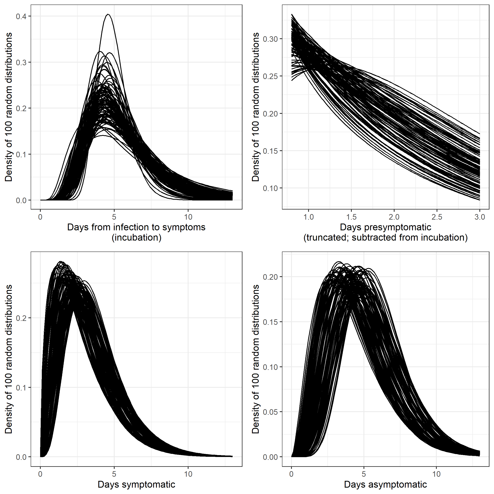
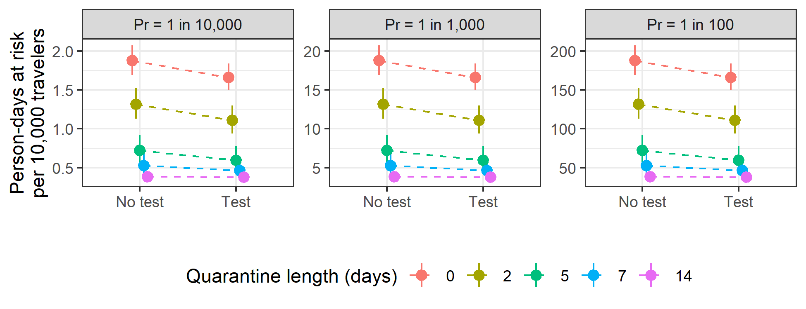

\newcommand{\1}{\textbf{1}}


W. Alton Russell, MS^1^, David L. Buckeridge, MD, PhD, FRCPC^2^


<br>

^1^Department of Management Science and Engineering, Stanford University, Stanford, CA, USA

^2^School of Population and Global Health, McGill University, Montreal, QC, Canada


<br>

# Corresponding author

W. Alton Russell, altonr@stanford.edu

<br>

**Author contributions:** Both authors participated in the study design and analysis and had access to data and code. WAR drafted the manuscript, which DLB critically revised.

**Competing interest statement:** The authors have no conflicts to disclose

**Classification:** Physical Sciences/Applied Mathematics

**Key words:** COVID-19, travel and immigration policy, quarantine and isolation

<br>

**This file includes:**

Main text

Figures 1 to 2


#####

```{r setup, include=FALSE}
library(ggplot2)
library(data.table)
library(coarseDataTools)
library(googlesheets4)
library(gridExtra)
library(flextable)
library(officedown)
library(officer)
#library(knitr)
theme_set(theme_bw())

source("../quarantineApp/quarantine-functions.R")


dt_scenarios <- fread("../scenarios.csv")
dt_test_scenarios <- fread("../test_scenarios.csv")

# dt_scenarios[, scenario := ifelse(scenario == "",
#                                   "Traveling with symptoms",
#                                   scenario)]
dt_scenarios[ , scenario := factor(scenario,
                                   levels = c(
                                    "Base scenario",
                                    "All symptomatic",
                                    "10% asymptomatic",
                                    "70% asymptomatic",
                                    "All asymptomatic",
                                    "Low compliance",
                                    "Perfect compliance",
                                    "100% Sn when infectious",
                                    "Infected on arrival",
                                    "Traveling with symptoms"
                                   ))]

# dt_scenarios <- dt_scenarios[!(scenario == "Tested on arrival" & 
#                                  testing == 1 & 
#                                  quarantine_length == 0)]

fnum <- function(num){
  return(
    ifelse( num < 0.1, sprintf("%.3f", round(num,3)),
            ifelse(num < 1,
                   sprintf("%.2f", round(num,2)),
                   sprintf("%.1f", round(num,1))
                   )
            )
  )
  
}

```


```{r run_sims, include=FALSE, eval=FALSE}
library(truncdist)

#Incubation time from Lauer 2020 bootstrapped posteriors
incubation_dist_fit_lnorm <- readRDS("../incubation_dists/ncov_inc_fit_boot.rds")
dt_incubation_dists_lnorm <- data.table(incubation_dist_fit_lnorm@samples)


params <- list(
            prob_asympt = 0.4,
            prob_isolate_test = 0.9,
            prob_isolate_sympt = 0.8,
            prob_isolate_both = 1.0,
            sn_presympt = 0.7,
            sn_sympt = 0.7,
            sn_asympt = 0.6,
            prob_quarantine_compliance = 0.8,
            dur_presympt_mean_lb = 1.8,
            dur_presympt_mean_ub = 2.8,
            dur_presympt_var_lb = 4.0,
            dur_presympt_var_ub = 6.0,
            dur_sympt_mean_lb = 2.6,
            dur_sympt_mean_ub = 3.9,
            dur_sympt_var_lb = 3.0,
            dur_sympt_var_ub = 4.5,
            dur_asympt_mean_lb = 4.0,
            dur_asympt_mean_ub = 6.0,
            dur_asympt_var_lb = 4.0,
            dur_asympt_var_ub = 6.0,
            n_iters = 1000,
            dur_quarantine = c(0, 2, 5, 7, 14),
            seed = 91,
            infection_timing = "rand_presympt",
            test_on_arrival = FALSE
        )


#Create scenarios
add_scenario <- function(dt_scenarios_wide, dt_scenario_long){
  return(
    rbind(
      dt_scenarios_wide,
      dcast(dt_scenario_long,  quarantine_length+testing+scenario ~ quantile, value.var = "value")
    )
  )
}

#Base scenario
dt_metrics_basecase <- cbind(
  run_sim(params = params, dt_incubation_dists_lnorm = dt_incubation_dists_lnorm),
  scenario = "Base scenario"
)


dt_scenarios <- dcast(dt_metrics_basecase,  quarantine_length+testing+scenario ~ quantile, value.var = "value")


#Perfect compliance
params.perfect_compliance <- params
params.perfect_compliance$prob_isolate_test = 1
params.perfect_compliance$prob_isolate_sympt = 1
params.perfect_compliance$prob_isolate_both = 1
params.perfect_compliance$prob_quarantine_compliance = 1

Sys.time()
dt_metrics_perf_compliance <- cbind(
  run_sim(params = params.perfect_compliance, dt_incubation_dists_lnorm = dt_incubation_dists_lnorm),
  scenario = "Perfect compliance"
)

dt_scenarios <- add_scenario(dt_scenarios, dt_metrics_perf_compliance)

#Low compliance
params.low_compliance <- params
params.low_compliance$prob_isolate_test = 0.5
params.low_compliance$prob_isolate_sympt = 0.5
params.low_compliance$prob_isolate_both = 0.7
params.low_compliance$prob_quarantine_compliance = 0.4


Sys.time()
dt_metrics_low_compliance <- cbind(
  run_sim(params = params.low_compliance, dt_incubation_dists_lnorm = dt_incubation_dists_lnorm),
  scenario = "Low compliance"
)


dt_scenarios <- add_scenario(dt_scenarios, dt_metrics_low_compliance)


#Low asymptomatic
params_asympt_low <- params
params_asympt_low$prob_asympt = .1

Sys.time()
dt_metrics_asympt_low <- cbind(
  run_sim(params = params_asympt_low, dt_incubation_dists_lnorm = dt_incubation_dists_lnorm),
  scenario = "10% asymptomatic"
)

dt_scenarios <- add_scenario(dt_scenarios, dt_metrics_asympt_low)

#High asymptomatic
params_asympt_high <- params
params_asympt_high$prob_asympt = .7

Sys.time()
dt_metrics_asympt_high <- cbind(
  run_sim(params = params_asympt_high, dt_incubation_dists_lnorm = dt_incubation_dists_lnorm),
  scenario = "70% asymptomatic"
)


dt_scenarios <- add_scenario(dt_scenarios, dt_metrics_asympt_high)


#all asymptomatic
params_all_asympt <- params
params_all_asympt$prob_asympt = 1

Sys.time()
dt_metrics_all_asympt <- cbind(
  run_sim(params = params_all_asympt, dt_incubation_dists_lnorm = dt_incubation_dists_lnorm),
  scenario = "All asymptomatic"
)

dt_scenarios <- add_scenario(dt_scenarios, dt_metrics_all_asympt)

#all symptomatic
params_all_sympt <- params
params_all_sympt$prob_asympt = 0

Sys.time()
dt_metrics_all_sympt <- cbind(
  run_sim(params = params_all_sympt, dt_incubation_dists_lnorm = dt_incubation_dists_lnorm),
  scenario = "All symptomatic"
)

dt_scenarios <- add_scenario(dt_scenarios, dt_metrics_all_sympt)

#Perfect sensitivity
params_sn_perfect <- params
params_sn_perfect$sn_asympt = 1
params_sn_perfect$sn_presympt = 1
params_sn_perfect$sn_sympt = 1

Sys.time()
dt_metrics_sn_perfect <- cbind(
  run_sim(params = params_sn_perfect, dt_incubation_dists_lnorm = dt_incubation_dists_lnorm),
  scenario = "100% Sn when infectious"
)


dt_scenarios <- add_scenario(dt_scenarios, dt_metrics_sn_perfect)


# #Poor sensitivity asympt
# params_asympt_sn_poor <- params
# params_asympt_sn_poor$sn_asympt = 0.3
# 
# Sys.time()
# dt_metrics_asympt_sn_poor <- cbind(
#   run_sim(params = params_asympt_sn_poor, dt_incubation_dists_lnorm = dt_incubation_dists_lnorm),
#   scenario = "Asympt. sensitivity 30%"
# )
# 
# 
# dt_scenarios <- add_scenario(dt_scenarios, dt_metrics_asympt_sn_poor)


params_inf_on_arrival <- params
params_inf_on_arrival$infection_timing <- "on_arrival"
#Infectioned at quarantine start
Sys.time()
dt_metrics_infect_on_arrival <- cbind(
  run_sim(params = params_inf_on_arrival, dt_incubation_dists_lnorm = dt_incubation_dists_lnorm),
  scenario = "Infected on arrival"
)

dt_scenarios <- add_scenario(dt_scenarios, dt_metrics_infect_on_arrival)


params_travel_while_symptomatic <- params
params_travel_while_symptomatic$infection_timing <- "rand_incl_sympt"
#Traveling while symptomatic
Sys.time()
dt_metrics_travel_while_symptomatic <- cbind(
  run_sim(params = params_travel_while_symptomatic, dt_incubation_dists_lnorm = dt_incubation_dists_lnorm),
  scenario = "Traveling with symptoms"
)

dt_scenarios <- add_scenario(dt_scenarios, dt_metrics_travel_while_symptomatic)


fwrite(dt_scenarios, file = "../scenarios.csv")


dt_test_scenarios <- dt_scenarios[scenario %in% c("Perfect compliance", "Low compliance")]

#Test on arrival; Perfect compliance
params.toa_perfect_compliance <- params.perfect_compliance
params.toa_perfect_compliance$test_on_arrival = TRUE

Sys.time()
dt_metrics_toa_perfect_compliance <- cbind(
  run_sim(params = params.toa_perfect_compliance, dt_incubation_dists_lnorm = dt_incubation_dists_lnorm),
  scenario = "TOA perfect compliance"
)
#dt_metrics_test_twice <- dt_metrics_test_twice[!(quarantine_length == 0 & testing == 1)]
dt_test_scenarios <- add_scenario(dt_test_scenarios, dt_metrics_toa_perfect_compliance)

#Test on arrival; low compliance
params.toa_low_compliance <- params.low_compliance
params.toa_low_compliance$test_on_arrival = TRUE

Sys.time()
dt_metrics_toa_low_compliance <- cbind(
  run_sim(params = params.toa_low_compliance, dt_incubation_dists_lnorm = dt_incubation_dists_lnorm),
  scenario = "TOA low compliance"
)
#dt_metrics_test_twice <- dt_metrics_test_twice[!(quarantine_length == 0 & testing == 1)]
dt_test_scenarios <- add_scenario(dt_test_scenarios, dt_metrics_toa_low_compliance)

fwrite(dt_test_scenarios, file = "../test_scenarios.csv")

```


```{r fig_scenarios, include = FALSE}

dt_scenarios[ , testing := factor(testing)]

scenario_labs <- c("Base scenario",
                          "All symptomatic",
                          "10% asymptomatic",
                          "70% asymptomatic",
                          "All asymptomatic",
                          "Low compliance",
                          "Perfect compliance",
                          "100% Sn\nwhen infectious",
                          "Infected on arrival",
                          "Traveling\nwith symptoms" )

names(scenario_labs) <- c("Base scenario",
                          "All symptomatic",
                          "10% asymptomatic",
                          "70% asymptomatic",
                          "All asymptomatic",
                          "Low compliance",
                          "Perfect compliance",
                          "100% Sn when infectious",
                          "Infected on arrival",
                          "Traveling with symptoms" )
                                    
  


plt_scenarios <-    ggplot(data = dt_scenarios)+
      geom_pointrange(aes(x = testing, y = q0.5, ymin = q0.01, ymax = q0.99, color = factor(quarantine_length), group = factor(quarantine_length)),
                      position = position_dodge(width = 0.2))+
      facet_wrap(facets=vars(scenario), ncol = 5, labeller = labeller(scenario = scenario_labs))+
      xlab("")+
      ylab("Days at risk of community transmission per infected traveler")+
      scale_color_discrete(name="Quarantine length (days)")+
      scale_x_discrete(labels = c("No test", "Test"))+
      geom_line(aes(x = testing, y = q0.5, group = factor(quarantine_length), color = factor(quarantine_length)), linetype="dashed", position = position_dodge(width = 0.2))+
      theme(legend.position = "bottom",
            strip.text.x = element_text(size = 8),
            axis.text = element_text(size = 8),
            axis.title = element_text(size = 8),
            legend.text = element_text(size = 8),
            legend.title = element_text(size = 8))

ggsave(
  "figs/fig_scenarios.png",
  width = 6.5,
  height = 5,
  units = "in"
)


```


```{r fig_secondarycases, include = FALSE}

# dt_prev <- dt_scenarios[scenario == "Base scenario"]

dt_scenarios[ , testing := factor(testing)]


secondary.labs <- c("0.1 infections/day",
                    "0.5 infections/day",
                    "1.0 infections/day")
names(secondary.labs) <- c(0.1, 0.5, 1)

cols = c("q0.01", "q0.5", "q0.99")
dt_secondary <- rbind(
  cbind(dt_scenarios[scenario == "Base scenario"][ , (cols) := lapply(.SD, function(x) x*0.1*10000*(1/1000)), .SDcols = cols],
        secondary_factor = 0.1),
  cbind(dt_scenarios[scenario == "Base scenario"][ , (cols) := lapply(.SD, function(x) x*0.5*10000*(1/1000)), .SDcols = cols],
        secondary_factor = 0.5),
  cbind(dt_scenarios[scenario == "Base scenario"][ , (cols) := lapply(.SD, function(x) x*1*10000*(1/1000)), .SDcols = cols],
        secondary_factor = 1.0)
)

plt_secondarycases <-  ggplot(data = dt_secondary)+
      geom_pointrange(aes(x = testing, y = q0.5, ymin = q0.01, ymax = q0.99, color = factor(quarantine_length), group = factor(quarantine_length)),
                      position = position_dodge(width = 0.2))+
      facet_wrap(facets=vars(secondary_factor), labeller = labeller(secondary_factor = secondary.labs))+
      xlab("")+
      ylab("Secondary infections per\n10,000 travelers\n(1 in 1000 travelers infected)")+
      scale_color_discrete(name="Quarantine length (days)")+
      scale_x_discrete(labels = c("No test", "Test"))+
      geom_line(aes(x = testing, y = q0.5, group = factor(quarantine_length), color = factor(quarantine_length)), linetype="dashed", position = position_dodge(width = 0.2))+
      theme(legend.position = "bottom",
            strip.text.x = element_text(size = 8),
            axis.text = element_text(size = 8),
            axis.title = element_text(size = 8),
            legend.text = element_text(size = 8),
            legend.title = element_text(size = 8)
            )

ggsave(
  "figs/fig_secondarycases.png",
  width = 6.5,
  height = 2.5,
  units = "in"
)

```

```{r fig_testtwice, include = FALSE}
#dt_test_options <- cbind(dt_scenarios[scenario %in% c("Base scenario", "Tested on arrival")])

dt_test_scenarios[ , compliance := ifelse(scenario %in% c("Perfect compliance", "TOA perfect compliance"),
                                          "Perfect compliance",
                                          "Low compliance")]

dt_test_scenarios[ ,
                 test_scenario := ifelse(
                   scenario %in% c("TOA low compliance", "TOA perfect compliance"),
                   ifelse(testing == 0,
                          "On arrival",
                          "Both"),
                   ifelse(testing == 0,
                          "No testing",
                          "24h before\nquarantine end")
                 )]

dt_test_scenarios[ , test_scenario := factor(test_scenario,
                                           levels = c("No testing",
                                                       "On arrival",
                                                       "24h before\nquarantine end",
                                                       "Both"
                                                       ))]


plt_testtwice <-    ggplot(data = dt_test_scenarios)+
      geom_pointrange(aes(x = test_scenario, y = q0.5, ymin = q0.01, ymax = q0.99, color = factor(quarantine_length), group = factor(quarantine_length)),
                      position = position_dodge(width = 0.2))+
      facet_grid(cols=vars(compliance))+
      xlab("")+
      ylab("Days at risk of community\ntransmission per infected traveler")+
      scale_color_discrete(name="Quarantine length (days)")+
      geom_line(aes(x = test_scenario, y = q0.5, group = factor(quarantine_length), color = factor(quarantine_length)), linetype="dashed", position = position_dodge(width = 0.2))+
      theme(legend.position = "bottom",
            strip.text.x = element_text(size = 8),
            axis.text = element_text(size = 8),
            axis.title = element_text(size = 8),
            legend.text = element_text(size = 8),
            legend.title = element_text(size = 8)
            )

ggsave(
  "figs/fig_testtwice.png",
  width = 6,
  height = 3.5,
  units = "in"
)

```

```{r table_scenarios, include = FALSE}
dt_table <- rbind(dt_scenarios)


dt_table[ , print_txt := paste0(
   fnum(q0.5),
  " (", 
  fnum(q0.01),
  " - ", 
  fnum(q0.99),
  ")"
)]

dt_table[ , quarantine_length := factor(paste0(quarantine_length, " days"),
                            levels = c("0 days",
                                       "2 days",
                                       "5 days",
                                       "7 days",
                                       "14 days")
                            )]
dt_table[ , Scenario := scenario]
dt_table[ , Test := ifelse(testing==1, "T", "NT")]


dt_table_wide <- dcast(dt_table, Scenario+Test~quarantine_length, value.var = "print_txt")


t1 <- flextable(dt_table_wide)
t1 <- merge_v(t1, j=1)
#t1 <- add_header(t1, "0" <- "Quarantine length (days)")
t1 <- width(t1, j=3:7, 1.3)
t1 <- width(t1, j=2, 0.5)
t1 <- width(t1, j=1, 1.2)
#t1 <- theme_box(t1)
t1 <- theme_zebra(t1)
t1 <- fontsize(t1, size = 10, part = "all")
t1 <- font(t1, fontname = "Times", part = "all")
t1 <- hline(t1, i=2*(1:10), border = fp_border(color="black"))
t1 <- border_outer(t1, border = fp_border(color="black"))

```


```{r fig_compound, include = FALSE, fig.height = 7, fig.width = 6.5}
library(ggpubr)


ggarrange(plt_scenarios,
          plt_secondarycases,
          
          ncol = 1,
          labels = c("A", "B"),
          common.legend = TRUE, legend = "bottom",
          heights = c(4, 2))
          
          
ggsave(
  "figs/fig_compound.png",
  width = 6.5,
  height = 6.5,
  units = "in"
)


```

# Abstract

New COVID-19 transmission from arriving travelers represent a major risk. Countries have used various risk mitigation strategies, including travel bans and mandatory quarantine and testing. We developed a mathematical simulation to evaluate the effectiveness of quarantine and testing, alone and in combination, across a variety of scenarios. We found that quarantine was more effective than testing alone, even for quarantine as short as two days, and the value of adding testing to quarantine diminished for longer quarantine durations. Testing was most effective if performed near the end of quarantine, but testing upon arrival may be more effective in situations where compliance with later testing cannot be enforced. Compliance of travelers and the percent of infections that were asymptomatic greatly influenced policy effectiveness.


<br>


# Introduction

> COVID-19 outbreaks caused by infected arriving travelers are a concern for all countries, particularly those with low community transmission. Consequently, the approach to managing the risk of SARS-CoV-2 transmission from arriving travelers is a critical policy question. We evaluated the policy impact of mandatory quarantine for arriving travelers from 0 to 14 days, both alone and combined with testing. 

> Our base scenario assumed 40% of infections were asymptomatic [@CDC2020], 80% of travelers were compliant with quarantine, 80% isolated when symptomatic, 90% isolated after testing positive, and 100% isolated after testing positive when symptomatic. For policies that include testing, we assumed antigen testing was performed 24 hours before the end of quarantine and that travelers who did not comply with quarantine were not tested. Our base scenario assumed a test sensitivity of 70% in the pre-symptomatic and symptomatic infectious stages (for symptomatic infections) and 60% in thee asymptomatic infectious stage (for asymptomatic infections) [@Bisoffi2020]. We assumed infections were not detectable before the infectious stages. We assessed the expected number of days at risk of community transmission per infected traveler (i.e., days when an infectious traveler is in the community because they are not in quarantine or isolation) across several scenarios.

<br>

# Results

> In the base scenario, we estimated a 98% credible interval of `r dt_scenarios[scenario == "Base scenario" & testing == 0 & quarantine_length == 0, paste0(fnum(q0.01), "--", fnum(q0.99))]` days at risk of community transmission with no intervention (Fig. 1A). Assuming a prevalence of 1 active infection per 10,000 travelers and a secondary infection rate of 0.5 per person-day at risk of community transmission, this risk of community transmission translated to `r dt_secondary[quarantine_length == 0 & testing == 0 & secondary_factor == 0.5, paste0(fnum(q0.01), "--", fnum(q0.99))]` secondary cases per 10,000 travelers (Figure 1B). The expected days at risk of community transmission was higher for travelers with asymptomatic infections than for travelers with symptomatic infections (median of `r dt_scenarios[scenario == "All asymptomatic" & quarantine_length == 0 & testing == 0, fnum(q0.5)]` vs. `r dt_scenarios[scenario == "All symptomatic" & quarantine_length == 0 & testing == 0, fnum(q0.5)]` days at risk). Even a two-day quarantine was more effective than testing alone (`r dt_scenarios[scenario == "Base scenario" & testing == 0 & quarantine_length == 2, paste0(fnum(q0.01), "--", fnum(q0.99))]` days at risk with two-day quarantine vs. `r dt_scenarios[scenario == "Base scenario" & testing == 1 & quarantine_length == 0, paste0(fnum(q0.01), "--", fnum(q0.99))]` with testing alone). The addition of testing had diminishing benefit as the length of quarantine increased (median reduction of `r fnum(dt_scenarios[scenario == "Base scenario" & quarantine_length == 2 & testing == 0, q0.5] - dt_scenarios[scenario == "Base scenario" & quarantine_length == 2 & testing == 1, q0.5])`, `r fnum(dt_scenarios[scenario == "Base scenario" & quarantine_length == 7 & testing == 0, q0.5] - dt_scenarios[scenario == "Base scenario" & quarantine_length == 7 & testing == 1, q0.5])`, and `r fnum(dt_scenarios[scenario == "Base scenario" & quarantine_length == 14 & testing == 0, q0.5] - dt_scenarios[scenario == "Base scenario" & quarantine_length == 14 & testing == 1, q0.5])` days at risk for 2, 7, and 14-day quarantine, respectively). The benefit of quarantine was highly sensitive to compliance: a 14-day quarantine resulted in `r dt_scenarios[scenario == "Low compliance" & testing == 0 & quarantine_length == 14, paste0(fnum(q0.01), "--", fnum(q0.99))]` days at risk assuming low compliance compared to `r dt_scenarios[scenario == "Perfect compliance" & testing == 0 & quarantine_length == 14, paste0(fnum(q0.01), "--", fnum(q0.99))]` days assuming perfect compliance. 

> The base scenario assumes that arriving travelers were equally likely to be at any point of their infection before symptom onset (for symptomatic infections). If instead all travelers were infected immediately before arriving, the days at risk per traveler would be `r paste0(round(100*(dt_scenarios[scenario == "Infected on arrival" & testing == 0 & quarantine_length == 0, q0.5]/dt_scenarios[scenario == "Base scenario" & testing == 0 & quarantine_length == 0, q0.5] - 1),0),"%")` higher than the base scenario assuming no intervention, and testing without quarantine would have little benefit. If individuals with symptomatic infections travel with symptoms (i.e., infected travelers are at a random point between infection and recovery), the days at risk per traveler would be `r paste0(round(100*(1 - dt_scenarios[scenario == "Traveling with symptoms" & testing == 0 & quarantine_length == 0, q0.5]/dt_scenarios[scenario == "Base scenario" & testing == 0 & quarantine_length == 0, q0.5]),0),"%")` lower than the base scenario assuming no intervention.

> We also evaluated testing on arrival as a condition of entry, which we assumed would have 100% compliance (Fig. 3). If compliance is low, testing on arrival was more effective than testing near the end of quarantine. However, with perfect compliance, testing 24 hours before quarantine ends was more effective than testing on arrival (with an exception for a 0 day quarantine, since in that case testing occurs 24 hours later in the 'on arrival' scenario than in the 'testing at the end of quarantine' scenario).


> We created a web application that readers can use to interactively assess impact of parameter values on infection risk ([https://shiny.mchi.mcgill.ca/arussel/quarantineTesting/](shiny.mchi.mcgill.ca/arussel/quarantineTesting/)).

<br>

# Discussion

> To reduce the risk of SARS-CoV-2 transmission from arriving travelers, quarantine is more effective than testing alone. Testing can add value when longer quarantine is infeasible, but the benefits of testing diminish with quarantine length. Testing with quarantine is most effective if testing is performed as late as possible while providing results by the end of quarantine. However, it may be preferable to test earlier if compliance with later testing cannot be enforced. Measures to increase compliance with quarantine and isolation can significantly reduce risk. 

> While our results can help guide decisions around quarantine and testing of arriving travelers, policymakers should consider the local situation in determining acceptable risk. For instance, the tolerance for community transmission may be lower (i.e., stricter policies may be preferred) when local transmission is very low, since new outbreaks could necessitate costly lockdowns. The tolerance for risk due to travelers may also be low in jurisdictions where local transmission is already threatening to exhaust healthcare resources. We did not consider household transmission during quarantine, a substantial risk for countries with less strict quarantine enforcement. 

<br>

# Materials and methods

> We simulated the disease stages of travelers with asymptomatic infections (non-infectious phase and asymptomatic-infectious phase) and symptomatic infections (non-infectious phase, pre-symptomatic-infectious phase, and symptomatic phase). We used code from Lauer 2020 to sample 1,000 bootstrapped lognormal parameters for the incubation time distribution [@Lauer2020]. Following Moghadas 2020, we used gamma distributions for the durations of asymptomatic-infectious, pre-symptomatic-infectious, and symptomatic-infectious phases, and we truncated the pre-symptomatic-infectious distribution  from 0.8 to 3 days [@Moghadas2020]. We introduced uncertainty by varying the distributions' mean and variance uniformly by ±20%, and we sampled 1,000 parameter sets for the duration distributions. For each duration parameter set, we simulated 1,000 travelers with asymptomatic infection and 6,000 travelers with symptomatic infection. We determined the time each simulated traveler first became infectious, recovered from being infectious, and first developed symptoms (only for those with symptomatic infections). Using expressions described in the supplement, we calculated the average days at risk across all infected travelers. We have published all data and code [@Russell2020a].

<br>

# References

<div id="refs"></div>


#####


![**Fig. 1.** (A) Expected days at risk of community transmission risk per infectious traveler for ten scenarios. \'Low compliance\' scenario assumes 40% of travelers comply with quarantine, 50% isolate with symptoms or a positive test, and 70% isolate with both symptoms and a positive test.  (B) Expected number of secondary infections for 10,000 travelers under base scenario assumptions assuming an active SARS-CoV-2 infection prevalence of 1 in 1,000 travelers. Points indicates the median and bars indicate 98% credible interval for each estimate. Abbreviations: Sn, sensitivity.](figs/fig_compound.png)


#####


##### 


<!-- ::: {custom-style="Compact"} -->
<!-- | **Table S1** Expected days at risk of community transmission risk per infectious traveler for ten scenarios based on quarantine length and testing. Median and 98% credible interval provided. Abbreviations: asympt, asymptomatic; T, test used; NT, no testing used. -->
<!-- ::: -->


<!-- `r t1` -->


\setcounter{page}{0}

# Extended methods

<br>

# Calculation of days at risk based on quarantine duration and testing


> We calculated the expected number of days at risk of community transmission for each person with an active SARS-CoV-2 infection (either pre-infectious or infectious) using the expressions below. In the expressions below, time is with respect to the time of infection $t_0$.

## Without testing on arrival

> **Asymptomatic infections** Travelers with asymptomatic infection comply with quarantine with probability $P_q$. If they do not comply, they will be infectious in the community from the greater of the time they become infectious ($t_i$) and the time they arrive ($u$), and their "infectious days in community" will end when they recover, $t_r$. If they comply with quarantine, their infectious days will begin at the greater of $t_i$ and when quarantine ends, represented by $u+d$. Therefore, the expected number of days at risk of community transmission for asymptomatic individuals with no testing is:

$\begin{align*}
(1-P_{q})[t_{r} - \max(t_i, u)]^+ + P_{q} [t_r - \max(t_i, u+d)]^+
\end{align*}$

> For testing 24 hours before quarantine ends, we assume those who do not comply with quarantine also do not receive testing. Those who are compliant are tested 1 day before quarantine end ($u+d-1$). If they are tested before becoming infectious ($u+d-1<t_i$) they will test negative and be at risk of community transmission from the greater of $t_i$ and $d+u$ until $t_r$. If they are tested while infectious, they will only be at risk of community transmission if they test false-negative (probability $1-Sn_A$ where $Sn_A$ is test sensitivity during the asymptomatic-infectious stage) or if they test positive but refuse to quarantine ($Sn_A(1-P_{it})$ where $P_{it}$ is probability of isolation given a positive test and no symptoms). Therefore, the expected number of days at risk of community transmission for asymptomatic individuals with testing 24 hours before end of quarantine is:

$\begin{align*}
(1-P_{q})&[t_{r} - \max(t_i, u)]^+ + \\
P_{q}    &\Big(  \1 _{\{u+d-1<t_i\}} [t_r - \max(t_i, d+u)]^+  + \\
          &\1_{\{u+d - 1 \geq t_i\}} \big((1-Sn_A)+Sn_A (1-P_{it})  \big) [ t_r - (u+d)) ]^+ \Big)
\end{align*}$

> **Symptomatic infections**  For travelers with symptomatic infections we calculate the days at risk of community transmission separately for the pre-symptomatic and symptomatic disease stages. Days at risk during the pre-symptomatic stage are calculated the same as asymptomatic days except that the endpoint for pre-symptomatic days at risk is the time that symptoms begin ($t_s$) rather than the time of recovery ($t_r$), and we use test sensitivity for detecting disease in the pre-symptomatic-infectious stage ($Sn_P$). Therefore, the expected number of days at risk of community transmission while in **pre-symptomatic phase** without testing 24 hours before end of quarantine is:

$\begin{align*}
(1-P_{q}) [t_s - \max(t_i, u)]^+ + P_{q} [t_s - \max(t_i,u+d)]^+
\end{align*}$

With testing 24 hours before end of quarantine, it becomes: 


$\begin{align*}
(1-P_{q}) &[t_s - \max(t_i, u)]^+ + \\
P_{q} &\Big[\1_{\{u+d-1 < t_i \}} [t_s - \max(t_i, u+d)]^+  + \\
      &\1_{\{u+d-1 \geq t_i\}} \big((1-Sn_P)+Sn_P (1-P_{it})\big)[t_s - (u+d)]^+   \Big]
\end{align*}$

> We assume travelers will isolate while in symptomatic-infectious stage with probability $P_{is}$. Days at risk while symptomatic begin at $t_s$, the time symptoms begin, and end at $t_r$, the time of recovery when individuals are no longer infectious. Therefore, the expected number of days at risk of community transmission while in **symptomatic phase** without testing 24 hours before end of quarantine is:

$\begin{align*}
(1-P_{is})\Big( (1-P_{q}) &[t_r - \max(t_s, u)]^+ +\\
P_{q} &[t_r - \max(t_s,u+d)]^+ \Big)
\end{align*}$

> In policies with testing, we assume that the days at risk for those who do not comply with quarantine (probability $(1-P_q)$) is unchanged because they also do not get tested. For those who comply, if they are tested before infectious ($u+d-1<t_i$) then they will test negative. With probability $1-P_{is}$ they will not isolate and incur days at risk until $t_r$. If tested duirng pre-symptomatic infectious stage ($t_i\leq u+d-1<t_s$), they will incur days at risk while symptomatic  if they test false negative (probability $(1-Sn_P$)) and they do not isolate (probability $(1-P_{is}$) or if they test positive and refuse to isolate ($Sn_P(1-P_{ib})$, where $P_{ib}$ is probabiilty of isolating with both a positive test and symptoms). For those tested while symptomatic, they will incur days at risk if the test is false negative ($1-Sn_S$ where $Sn_S$ is test sensitivity for those in symptomatic-infectious state) or if they test positive and refuse to isolate ($Sn_S(1-P_{ib})$). Therefore, the expected number of days at risk of community transmission while in the symptomatic-infectious phase with testing 24 hours before end of quarantine is:


$\begin{align*}
(1-P_{q})&(1-P_{is}) [t_r - \max(t_s, u))]^+ +\\
P_{q}  & \Bigg(\1_{\{u+d-1 < t_i \}} [ (1-P_{is})[t_r - \max(t_s, u+d)]^+  ]+ \\
       &\1_{\{t_i \leq u+d-1 <  t_s\}} [((1-Sn_P)(1-P_{is})  + Sn_P (1-P_{ib})) [t_r - \max(t_s,u+d)]^+] + \\
       &\1_{\{u+d-1 \geq  t_s\}}[((1-Sn_S)(1-P_{is}) + Sn_S (1- P_{ib})) [t_r - (u+d)]^+] \Bigg)
\end{align*}$

## With testing on arrival


> **Asymptomatic infections** With testing on arrival alone (no testing 24 hours before end of quarantine), the person-days of community risk for a traveler with an asymptomatic infection is:


$\begin{align*}
\1_{ \{ u < t_i \} }    &[ (1-P_{q})[t_{r} - t_i] + P_{q} [t_r - \max(t_i, u+d)]^+ ] + \\
\1_{ \{ u \geq t_i \} } & [(1-P_{q})((1-Sn_A)+Sn_A(1-P_{it}))[t_{r} - u]^+ + \\
                        & \quad P_q ((1-Sn_A)+Sn_A(1-P_{it})) [t_r - (u+d)]^+]
\end{align*}$


With both testing on arrival and testing 24 hours before end of quarantine, the person-days of community risk for a traveler with an asymptomatic infection is:


$\begin{align*}
\1_{ \{ u < t_i \} }    & [ (1-P_{q})[t_{r} - t_i] + \\ 
                        & P_{q} \big(\1_{\{ u+d-1 < t_i \}} [ t_r - \max(t_i, d+u )]^+ + \\
                        & \quad \1_{\{ u+d-1 \geq t_i \}} [((1-Sn_A)+Sn_A(1-P_{it}) ) [t_r - (u+d)]^+]\big) ]+\\ 
\1_{ \{ u \geq t_i \} } &[ (1-P_q)((1-Sn_A)+Sn_A(1-P_{it}))[t_r - u]^+ + \\
                        & \quad P_q ((1-Sn_A)^2 + (1-(1-Sn_A)^2) (1-P_{it})) [t_r - (u+d)]^+]
\end{align*}$


> **Symptomatic infections** With testing on arrival without testing 24 hours before end of quarantine, the person-days of community risk for a traveler with a symptomatic infection in the **pre-symptomatic phase** is:


$\begin{align*}
\1_{ \{ u < t_i \} }    & [ (1-P_{q})[t_{s} - t_i] + P_{q} [t_s - \max(t_i, u+d)]^+ ] + \\
\1_{ \{ u \geq t_i \} } & [(1-P_{q})((1-Sn_P)+Sn_P(1-P_{it}))[t_{s} - u]^+ + P_q ((1-Sn_P)+Sn_P(1-P_{it})) [t_s - (u+d)]^+]
\end{align*}$

With both testing on arrival and testing 24 hours before end of quarantine, the person-days of community risk for a traveler with a symptomatic infection in the **pre-symptomatic phase** is:

$\begin{align*}
\1_{ \{ u < t_i \} }    & [ (1-P_{q})[t_{s} - t_i] + \\
                        & \quad P_{q} \big(\1_{\{ u+d-1 < t_i \}} [ t_s - \max(t_i, d+u)]^+ + \\
                        &  \quad \quad \1_{\{ u+d-1 \geq t_i \}} [((1-Sn_P)+Sn_P(1-P_{it}) ) [t_s - (u+d)]^+] \big) ] + \\
\1_{ \{ u \geq t_i \} } & [(1-P_q)((1-Sn_P)+Sn_P(1-P_{it}))[t_s - u]^+ + \\
                        & \quad P_q ((1-Sn_P)^2 + (1-(1-Sn_P)^2) (1-P_{it})) [t_s - (u+d)]^+]
\end{align*}$


With testing on arrival without testing 24 hours before end of quarantine, the person-days of community risk for a traveler with a symptomatic infection in the **symptomatic phase** is:


$\begin{align*}
\1_{ \{ u < t_i \} }            & [ (1-P_{q})(1-P_{is})[t_{r} - t_s] + P_{q} (1-P_{is}) [t_r - \max(t_s, u+d)]^+ ] + \\
\1_{ \{ t_i \leq u < t_s \} }   & [ (1-P_{q})((1-Sn_P)(1-P_{is}) + Sn_P(1-P_{ib}) [t_r - t_s]) + \\
                                & \quad P_{q} ((1-Sn_P)(1-P_{is}) + Sn_P(1-P_{ib}))[t_r - \max(u+d, t_s)]^+ ] + \\
\1_{ \{ u \geq t_s \} }         &[(1-P_q)((1-Sn_S)(1-P_{is}) + Sn_S (1-P_{ib}))[t_r - u]^+ \\
                                & \quad P_q ((1-Sn_S)(1-P_{is}) + Sn_S (1-P+{ib})) [t_r - (u+d)]^+]
\end{align*}$


With both testing on arrival and testing 24 hours before end of quarantine, the person-days of community risk for a traveler with a symptomatic infection in the **symptomatic phase** is:

$\begin{align*}
\1_{ \{ u < t_i \} } 
[A]
+
\1_{ \{ t_i \leq u < t_s \} } 
[B]
+ 
\1_{ \{ u \geq t_i \} } 
[C],
\end{align*}$

where $A$ is the expected person-days for travelers who arrive before they are infectious (or detectable), $B$ is the expected person-days for travelers who arrive in the pre-symptomatic infectious stage, and $C$ is the expected person days for travelers who arrive during or after the symptomatic infectious stage: 


$\begin{align*}
A=& (1-P_q)(1-P_{is})[t_r - t_s] +\\ 
  & P_q \bigg( \1_{ \{ u+d-1 < t_i \} } [(1-P_{is}) [t_r - \max(t_s, u+d)]^+  ] +\\
  & \quad \1_{ \{ t_i  \leq  u+d-1 < t_s \} } [(1-Sn_P)(1-P_{is}) + Sn_P (1-P_{ib})) [t_r - \max(t_s, u+d)]^+] +\\
  & \quad \1_{ \{ u +d - 1 \geq t_s \} } [(1-Sn_S)(1-P_{is}) [t_r - (u+d)]^+ + Sn_S (1-P_{ib}) [t_r - (u+d)]^+  ]\bigg)\\
B=& (1-P_q)((1-Sn_P)(1-P_{is}) + Sn_P(1-P_{ib})) [t_r - t_s]+\\
  & P_q \bigg( \1_{ \{ t_i  \leq  u+d-1 < t_s \} }[((1-Sn_P)^2(1-P_{is}) + \\
  & \quad \quad (1-(1-Sn_P)^2)(1-P_{ib}))[t_r - \max(t_s, u+d)]^+]+\\
  & \quad \1_{ \{ u +d - 1 \geq t_s \} } [((1-Sn_P)(1-Sn_S)(1-P_{is}) + \\
  & \quad \quad (1-(1-Sn_P)(1-Sn_S))(1-P_{ib}))[t_r - (u+d)]^+  \bigg)\\
C =& (1-P_q)((1-Sn_S)(1-P_{is}) + Sn_S (1-P_{ib})) [t_r - u]^+ + \\
   & P_q  \big((1-Sn_S)^2 (1-P_{is}) + (1-(1-Sn_s)^2)(1=P_{ib})\big) [t_r - (u+d)]^+
\end{align*}$


<!-- ##### -->


<!-- ::: {custom-style="Compact"} -->
<!-- | **Figure S1:** Sample of 100 distributions for durations. Incubation time (top-left) generated using code from Lauer 2020 [@Lauer2020] that generates bootstrapped posterior distributions from their parametric accelerated failure time model calibration. Other distributions generated by varying the mean and variance of distributions from Moghadas 2020 [@Moghadas2020] by ±20% and converting to gamma distribution parameters using the relationships $\mu=ab$ and $\sigma^2=ab^2$ where $\mu$ and $\sigma$ are the mean and variance of the gamma distribution and $a$ and $b$ are the shape and scale parameters. -->
<!-- ::: -->

```{r FS1, include=FALSE, eval=FALSE} 


#Sample asympt duration gamma parameters
  dt_d_asympt <- data.table(
    mean = runif(100, min = params$dur_asympt_mean_lb, max = params$dur_asympt_mean_ub),
    var = runif(100, min = params$dur_asympt_var_lb, max = params$dur_asympt_var_ub)
  )
  dt_d_asympt[ , par1 := mean^2/var]
  dt_d_asympt[ , par2 := var/mean]
  
  #Sample sympt duration gamma parameters
  dt_d_sympt <- data.table(
    mean = runif(100, min = params$dur_sympt_mean_lb, max = params$dur_sympt_mean_ub),
    var = runif(100, min = params$dur_sympt_var_lb, max = params$dur_sympt_var_ub)
  )
  dt_d_sympt[ , par1 := mean^2/var]
  dt_d_sympt[ , par2 := var/mean]
  
  #Sample presympt duration gamma parameters (truncation implemented in iteration forloop below)
  dt_d_presympt <- data.table(
    mean = runif(100, min = params$dur_presympt_mean_lb, max = params$dur_presympt_mean_ub),
    var = runif(100, min = params$dur_presympt_var_lb, max = params$dur_presympt_var_ub)
  )
  dt_d_presympt[ , par1 := mean^2/var]
  dt_d_presympt[ , par2 := var/mean]

p_dist_incubation <-
    ggplot() + 
    mapply(function(par1, par2){
      stat_function(fun=dlnorm, args = list(meanlog=par1, sdlog=par2))},
      par1 = dt_incubation_dists_lnorm[1:100, ]$par1,
      par2 = dt_incubation_dists_lnorm[1:100, ]$par2
    )+
    scale_x_continuous(limits = c(0, 13))+
    xlab("Days from infection to symptoms\n(incubation)")+
  ylab("Density of 100 random distributions")
  
p_dist_presympt <-
  ggplot() + 
  mapply(function(par1, par2){
    stat_function(fun=dgamma, args = list(shape=par1, scale=par2))},
    par1 = dt_d_presympt[1:100, ]$par1,
    par2 = dt_d_presympt[1:100, ]$par2
  )+
  scale_x_continuous(limits = c(0.8, 3))+
  xlab("Days pre-symptomatic\n(truncated; subtracted from incubation)")+
  ylab("Density of 100 random distributions")

p_dist_sympt <- 
  ggplot() + 
  mapply(function(par1, par2){
    stat_function(fun=dgamma, args = list(shape=par1, scale=par2))},
    par1 = dt_d_sympt[1:100, ]$par1,
    par2 = dt_d_sympt[1:100, ]$par2
  )+
  scale_x_continuous(limits = c(0, 13))+
  xlab("Days symptomatic")+
  ylab("Density of 100 random distributions")

p_dist_asympt <-
  ggplot() + 
  mapply(function(par1, par2){
    stat_function(fun=dgamma, args = list(shape=par1, scale=par2))},
    par1 = dt_d_asympt[1:100, ]$par1,
    par2 = dt_d_asympt[1:100, ]$par2
  )+
  scale_x_continuous(limits = c(0, 13))+
  xlab("Days asymptomatic")+
  ylab("Density of 100 random distributions")


ggsave("figs/fig_distribution_sampling.png",
       grid.arrange(p_dist_incubation,
                    p_dist_presympt,
                    p_dist_sympt,
                    p_dist_asympt
       ),
       width = 8, height = 8, units = "in")

```

<!--  -->


<!-- ##### -->

```{r fig_S2, include = FALSE}
prev.labs <- c("Pr = 1 in 100", "Pr = 1 in 1,000", "Pr = 1 in 10,000")
names(prev.labs) <- c(1/100, 1/1000, 1/10000)


cols = c("q0.01", "q0.5", "q0.99")
dt_prev <- rbind(
  cbind(dt_scenarios[scenario == "Base scenario"][ , (cols) := lapply(.SD, function(x) x*10000*(1/100)), .SDcols = cols],
        prev = (1/100)),
  cbind(dt_scenarios[scenario == "Base scenario"][ , (cols) := lapply(.SD, function(x) x*10000*(1/1000)), .SDcols = cols],
        prev = (1/1000)),
  cbind(dt_scenarios[scenario == "Base scenario"][ , (cols) := lapply(.SD, function(x) x*10000*(1/10000)), .SDcols = cols],
        prev = (1/10000))
)


plt_persondays <-  ggplot(data = dt_prev)+
      geom_pointrange(aes(x = testing, y = q0.5, ymin = q0.01, ymax = q0.99, color = factor(quarantine_length), group = factor(quarantine_length)),
                      position = position_dodge(width = 0.2))+
      facet_wrap(facets=vars(prev), labeller = labeller(prev = prev.labs), scales = "free_y")+
      xlab("")+
      ylab("Person-days at risk\nper 10,000 travelers")+
      scale_color_discrete(name="Quarantine length (days)")+
      scale_x_discrete(labels = c("No test", "Test"))+
      geom_line(aes(x = testing, y = q0.5, group = factor(quarantine_length), color = factor(quarantine_length)), linetype="dashed", position = position_dodge(width = 0.2))+
      theme(legend.position = "bottom")


ggsave(
  "figs/figS2.png",
  width = 6.5,
  height = 2.5,
  units = "in"
)

```


<!-- ::: {custom-style="Compact"} -->
<!-- | **Fig. S2** Person-days at risk of community transmission per 10,000 arriving travelers for each policy by SARS-CoV-2 prevalence among travelers (base scenario). Person-days at risk for all travelers is calculated from the days at risk for an infectious traveler by multiplying the prevalence of active infection among arriving travelers. Points indicates the median and bars indicate 98% credible interval for each estimate. Abbreviations: Pr, prevalence of pre-infectious or infectiousness with SARS-CoV-2. -->
<!-- ::: -->

<!--  -->
